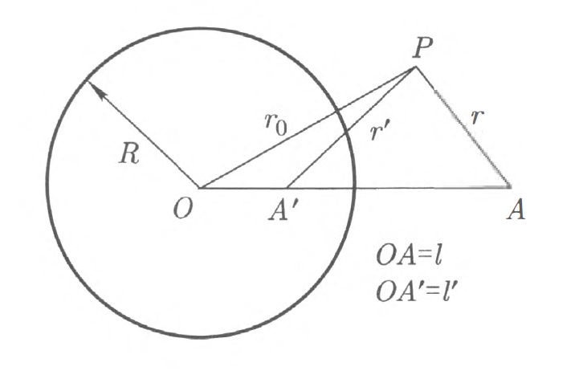

# Chapter 1 导体的静电学

## 前期准备

$$
    \newcommand{dbar}{\mathrm{d}\kern{-4.3pt}\bar{\small\phantom{q}}\kern{-0.7pt}}
    \newcommand{d}{\mathrm{d}}
    \newcommand{p}{\partial}
    \newcommand{l}{\left}
    \newcommand{r}{\right}
$$

**首先给出高斯单位制下真空中的电磁学基本公式以便查阅：
$$
    \begin{aligned}
    \nabla·\boldsymbol{E}&=4\pi\rho
    \\\nabla\times\boldsymbol{E}&=-\frac{1}{c}\frac{\partial\boldsymbol{B}}{\partial{t}}\
    \\\nabla·\boldsymbol{B}&=0
    \\\nabla\times\boldsymbol{B}&=\frac{4\pi}{c}\boldsymbol{J}+\frac{1}{c}\frac{\partial{\boldsymbol{D}}}{\partial{t}}
    \end{aligned}
$$**

**$$
    \begin{aligned}
    \\\boldsymbol{F}&=\frac{q_1q_2}{r^3}\boldsymbol{r}\qquad(库仑定律)
    \\\boldsymbol{F}&=q\boldsymbol{E}+\frac{q}{c}\boldsymbol{v}\times\boldsymbol{B}\qquad(广义洛伦兹力)
    \\\boldsymbol{B}&=\nabla\times\boldsymbol{A}\qquad(矢势)
    \\\boldsymbol{E}&=-\nabla\varphi-\frac{1}{c}\frac{\partial{\boldsymbol{A}}}{\partial{t}}\qquad(标势)
    \end{aligned}
$$**

**并附上高斯单位制中常见电磁学常量与物理量的关系：
$$
\begin{aligned}
    \\(\boldsymbol{E}_{SI},\varphi_{SI})&=\frac{1}{\sqrt{4\pi\varepsilon_0}}(\boldsymbol{E}_{Gauss},\varphi_{Gauss})
    \\(\boldsymbol{B}_{SI},{\Phi_m}_{SI},\boldsymbol{A}_{SI})&=\sqrt{\frac{\mu_0}{4\pi}}(\boldsymbol{B}_{Gauss},{\Phi_m}_{Gauss},\boldsymbol{A}_{Gauss})
    \\(q_{SI},\rho_{SI},I_{SI},\boldsymbol{J}_{SI},\boldsymbol{p}_{SI})&=\sqrt{4\pi\varepsilon_0}(q_{Gauss},\rho_{Gauss},I_{Gauss},\boldsymbol{J}_{Gauss},\boldsymbol{p}_{Gauss})
    \\c&=\frac{1}{\sqrt{\mu_0\varepsilon_0}}
\end{aligned}
$$**

----

## 1.导体的静电场

### (1).Laplace Equation

&emsp;&emsp;考虑到本笔记并不要求统计物理的知识，我们将跳过朗道原书中关于“宏观电场强度”与“微观电场强度”从统计物理角度的平均关系，直接讨论宏观电场所适用的规律。
&emsp;&emsp;由于我们接下来所讨论的是静电场，故我们假定此时真空中不存在磁场，所以根据 Maxwell Equations，对于真空中的恒定电场，我们始终有：
    $$
        \nabla·\boldsymbol{E}=0\qquad\nabla\times\boldsymbol{E}=0
    $$

因此，静电场是电势 $\varphi$ 的有势场，电场强度与电势的关系为：
    $$
        \boldsymbol{E}=-\nabla\varphi
    $$

将其带入上式左侧，即可得到著名的 Laplace Equation：
    $$
        \nabla^2\varphi=0
    $$

### (2).边界条件

&emsp;&emsp;电场 $\boldsymbol{E}$ 所符合的边界条件可以由 $\nabla\times\boldsymbol{E}=0$ 求出。选取导体某一表面元的法线方向为坐标系的 $z$ 轴正方向，假定研究的导体表面是均匀连续的（即不具有电荷分布的突变），则显然我们可以知道电场的 $z$ 分量在 $x$ 与 $y$ 方向的导数应当是有限值。而又由 $\nabla\times\boldsymbol{E}=0$ 有：
    $$
        (\nabla\times\boldsymbol{E})_x=\frac{\partial{\boldsymbol{E}}_z}{\partial{y}}-\frac{\partial{\boldsymbol{E}_y}}{\partial{z}}=0
    $$

于是我们就有：
    $$
        \frac{\partial{\boldsymbol{E}_y}}{\partial{z}}=\frac{\partial{\boldsymbol{E}}_z}{\partial{y}}
    $$

为一有限值。同理我们也可以得到 $\displaystyle\frac{\partial{\boldsymbol{E}_x}}{\partial{z}}$ 也为一有限值。这意味着 $E_x$ 与 $E_y$ 在导体分界面上连续。而又由于导体内部 $\boldsymbol{E}=0$，所以我们就可以得到第一个边界条件：
    $$
        \boldsymbol{E}_t=0
    $$

即电场的切向分量连续，且对于导体情况为零。
而关于垂直于导体表面的电场分量（即电场的 $z$ 分量），我们可以通过高斯定理的积分形式显然地将其与导体的面电荷分布联系在一起：
    $$
        \sigma=\frac{1}{4\pi}E_n=-\frac{1}{4\pi}\frac{\partial{\varphi}}{\partial{n}}
    $$

同时我们也可以得到导体上的总电荷量：
    $$
        q=-\frac{1}{4\pi}\oint\frac{\partial{\varphi}}{\partial{n}}\mathrm{d}S
    $$

除此之外，静电场还有一个十分有趣的性质：静电场内的电势分布在且仅在电场区域的边界处会有极大值或极小值。

----

## 2.导体的静电场能量

&emsp;&emsp;首先使用我们熟知的电场能量密度公式：
    $$
        \mathscr{U}=\int\frac{1}{8\pi}\boldsymbol{E}^2\mathrm{d}V
    $$

对上式进行一些变换：
    $$
        \mathscr{U}=-\int\frac{1}{8\pi}\boldsymbol{E}·\nabla\varphi\mathrm{d}V=\int\frac{1}{8\pi}\nabla·(\varphi\boldsymbol{E})\mathrm{d}V+\int\frac{1}{8\pi}\varphi\nabla·\boldsymbol{E}\mathrm{d}V
    $$

带入 Maxwell Equations，应用熟知的斯托克斯定理并注意无穷远处场收敛以及导体处处等势，我们有：
    $$
        \mathscr{U}=\frac{1}{8\pi}\sum\limits_n\oint\varphi E_n\mathrm{d}\boldsymbol{S}=\frac{1}{8\pi}\sum\limits_n\varphi_n\oint E_n\mathrm{d}\boldsymbol{S}=\frac{1}{2}\sum\limits_n q_n\varphi_n
    $$

&emsp;&emsp;导体的电荷和电势不可能同时以任意方式给定，他们之间存在确定的关系。由于场方程的线性与齐次性质，我们可以想到这种关系也应当是线性的。因此我们有：
    $$
        q^a={C^a}_{b}\varphi^b
    $$

其中 ${C^a}_b$ 称为静电感应系数，其缩并后的结果 ${C^a}_a$ 称为电容系数。特别的，如果系统只有一个导体，则有 $q=C\varphi$，其中 $C$ 直接被称为电容。
&emsp;&emsp;对能量的表达式求变分，我们有：
    $$
        \delta\mathscr{U}=\frac{1}{4\pi}\int\boldsymbol{E}·\delta\boldsymbol{E}\mathrm{d}V
    $$

带入 $\boldsymbol{E}=-\nabla\phi$，我们有：
    $$
    \begin{aligned}
        \delta\mathscr{U}&=-\frac{1}{4\pi}\int\nabla\varphi·\delta\boldsymbol{E}\mathrm{d}V
        \\&=-\frac{1}{4\pi}\int\nabla(\varphi\delta\boldsymbol{E})\mathrm{d}V+\frac{1}{4\pi}\int\varphi\nabla·\delta\boldsymbol{E}\mathrm{d}V
    \end{aligned}
    $$

注意到变分后的电场仍旧满足 Maxwell Equations，因而第二项直接为零，于是我们有：
    $$
    \begin{aligned}
        \delta\mathscr{U}&=-\frac{1}{4\pi}\int\nabla(\varphi\delta\boldsymbol{E})\mathrm{d}V
        \\&=-\frac{1}{4\pi}\oint\varphi\delta\boldsymbol{E}·\mathrm{d}\boldsymbol{S}
        \\&=-\frac{1}{4\pi}\sum\limits_n\varphi_n\oint\delta\boldsymbol{E}·\mathrm{d}\boldsymbol{S}
    \end{aligned}
    $$

再结合导体电荷的表达式，我们有：
    $$
        \delta\mathscr{U}=\sum\limits_n\varphi_n\delta{q_n}
    $$

其实这个结果是显而易见的，因为这正是将无穷小电荷 $\delta{q}_n$ 从无穷远处移动到导体上所做的功。
&emsp;&emsp;从另一个角度考虑，带入 $\delta\boldsymbol{E}=-\nabla\delta\varphi$，我们又有：
    $$
    \begin{aligned}
        \delta\mathscr{U}&=-\frac{1}{4\pi}\int\boldsymbol{E}·\nabla\delta\varphi\mathrm{d}V
        \\&=-\frac{1}{4\pi}\int\nabla{(\boldsymbol{E}\cdot\delta{\varphi})}\d{V}
        \\&=\frac{1}{4\pi}\sum_n\delta{\varphi_n}\oint{\boldsymbol{E}}\cdot\d{\boldsymbol{S}}
    \end{aligned}
    $$

亦即：
    $$
        \delta{\mathscr{U}}=\sum_n{e_n}\delta{\varphi_n}
    $$

也就是能量的变换可以用导体电势的变化表示。
因此我们就有：
    $$
        \frac{\p{\mathscr{U}}}{\p{e_n}}=\varphi^n
        \\\frac{\p{\mathscr{U}}}{\p{\varphi_n}}=e^n
    $$

又考虑到静电感应系数的定义，我们有：
    $$
        \frac{\p^2{\mathscr{U}}}{\p{\varphi^a}\p{\varphi^b}}=\frac{\p{e_a}}{\p{\varphi^b}}=C_{ab}
    $$

由于求导可以换序，所以我们显然有 $C_{ab}=C_{ba}$.

----

## 3.静电学问题的解法

&emsp;&emsp;首先，静电学问题的根本解法显然是静电学基本方程，即 Poisson Equation：
    $$
        \nabla^2{\varphi}=\frac{\rho}{\varepsilon_0}
    $$

考虑到导体/介电体上常常仅有表面有电荷分布，我们常常可以将上式退化为 Laplace Equation，即：
    $$
        \nabla^2\varphi=0
    $$

除此之外，我们还需要静电学问题所满足的边界条件。对于导体为，其边界条件为上文给出的：
    $$
        E_t=0\quad 等价于 \quad \varphi_S 为定值
    $$

以及：
    $$
        \sigma=-\frac{1}{4\pi}\frac{\p{\varphi}}{\p{n}}\qquad(电场法向分量正比于电荷面密度)
    $$

于是，理论上来说所有导体的静电学问题都可以利用 Laplace Equation 与相应的边界条件
这里直接给出球坐标系下 Laplace Equation 的形式：
    $$
        \frac{1}{r^2}\frac{\p}{\p{r}}\l(r^2\frac{\p{f}}{\p{r}}\r)+\frac{1}{r^2\sin{\theta}}\l(\sin{\theta}\frac{\p{f}}{\p{\theta}}\r)+\frac{1}{r^2\sin^2{\theta}}\frac{\p^2{f}}{\p{\varphi^2}}=0
    $$

其通解为：
    $$
        f(r,\theta,\varphi)=\sum_{l=0}^{\infty}\sum_{m=-l}^{l}\l(A_{l,m}r^l+\frac{B_{l,m}}{r^{l+1}}\r)P_l^m(\cos{\theta})e^{im\varphi}
    $$

其中 $A_{l,m}$ 与 $B_{l,m}$ 为一系列待定常数，$P_l^m(x)$ 为连带勒让德多项式，其形式为：
    $$
        P_l^m(x)=\{(-1)^m\}(1-x^2)^{\frac{m}{2}}\frac{\d^m}{\d{x}^m}P_l(x)
    $$

其中 $P_l(x)$ 为勒让德多项式，其形式为：
    $$
        P_l(x)=\frac{1}{2^l}\sum_{s=0}^{[l/2]}\frac{(-1)^s (2l-2s)!}{s!(l-s)!(l-2s)!}x^{l-2s}
    $$

$[x]$ 为向下取整；
其中常用的有：
    $$
    \begin{aligned}
        &P_0(x) = 1  && P_3(x) = \frac12 (5x^3 - 3x)
        \\&P_1(x) = x  && P_4(x) = \frac18 (35x^4 - 30x^2 + 3)
        \\&P_2(x) = \frac12 (3x^2 - 1) \qquad && P_5(x) = \frac18 (63x^5 - 70x^3 + 15x)
    \end{aligned}
    $$

----

### 例题1

接下来我们考虑一道经典例题：匀强电场 $E_0$ 中的接地导体球，求电势分布与面电荷。
*以下解答取国际单位制*

### Solution

首先写出通解：
    $$
        \varphi(r,\theta,\phi)=\sum_{l=0}^{\infty}\sum_{m=-l}^{l}\l(A_{l,m}r^l+\frac{B_{l,m}}{r^{l+1}}\r)P_l^m(\cos{\theta})e^{im\phi}
    $$

以及边界条件：
    $$
        \varphi(\infty)=-E_0z=-E_0r\cos{\theta}
        \\\l.\frac{\p{\varphi}}{\p{r}}\r|_{R}=-\frac{\sigma}{\varepsilon_0}
        \\\varphi(R)=0
    $$

考虑到体系的轴对称性，通解可以化为轴对称体系的通解：
    $$
        \varphi(r,\theta,\phi)=\sum_{l=0}^{\infty}\l(A_{l}r^l+\frac{B_{l}}{r^{l+1}}\r)P_l(\cos{\theta})
    $$

代入第一个边界条件，我们显然要有：
    $$
        \varphi(\infty,\theta,\phi)=\sum_{l=0}^{\infty}\l(A_{l}\infty^l+\frac{B_{l}}{\infty^{l+1}}\r)P_l(\cos{\theta})=-E_0\infty\cos{\theta}
    $$

这说明对于所有的 $l>1$，都需要有 $A_{l}=0$ 以保证无穷远处不出现高阶发散，于是我们就有：
    $$
        \varphi=A_0P_0(\cos{\theta})+A_1rP_1(\cos{\theta})+\sum_{l=0}^{\infty}\frac{B_l}{r^{l+1}}P_l(\cos{\theta})
    $$

以及：
    $$
        A_0P_0(\cos{\theta})+A_1rP_1(\cos{\theta})=-E_0r\cos{\theta}
    $$

考虑到 $P_0(\cos{\theta})=1$，$P_1(\cos{\theta})=\cos{\theta}$，我们有：
    $$
        A_0+A_1r\cos{\theta}=-E_0r\cos{\theta}
    $$

于是显然有：
    $$
        A_0=0
        \\A_1=-E_0
    $$

于是就有：
    $$
        -E_0rP_1(\cos{\theta})+\sum_{l=0}^{\infty}\frac{B_l}{r^{l+1}}P_l(\cos{\theta})
    $$

再带入 $r=R$ 时 $\varphi(R)=0$，我们有：
    $$
        -E_0RP_1(\cos{\theta})+\sum_{l=0}^{\infty}\frac{B_l}{R^{l+1}}P_l(\cos{\theta})=0
    $$

勒让德多项式的正交性告诉我们勒让德多项每一项都相互线性无关，因此右式等于零意味着多项式的每一项前面的系数都为零。于是我们显然有：
    $$
        -E_0R+\frac{B_1}{R^2}=0
        \\B_l=0\quad(l>1)
    $$

于是我们就有：
    $$
        B_1=E_0R^3
    $$

因而我们就求出了 $\varphi$ 的表达式：
    $$
        \varphi=-E_0r\cos{\theta}+\frac{E_0R^3}{r^2}\cos{\theta}
    $$

再使用第二个边界条件，我们有：
    $$
        \l.E_0\cos{\theta}+2E_0\frac{R^3}{r^3}\cos{\theta}\r|_{r=R}=\frac{\sigma}{\varepsilon_0}
    $$

即：
    $$
        \sigma=3\varepsilon_0E_0\cos{\theta}
    $$

于是我们也求出了面电荷分布。

----

### 例题2

导电椭球
*待补充*

----

### 静电场问题的其他解法

首先我们需要说明，以下的所有方法都是基于 Poisson Equation / Laplace Equation 本身的性质所能够导出的。

#### (1).镜像法

&emsp;&emsp;镜像法本身依赖于静电唯一性定理，亦即给定了边界条件（不论是 Dirichlet 边界条件/ Neumann 边界条件/混合边界条件）之后的 Laplace Equation 有唯一解。这也意味着 Laplace Equation 的解的具体形式仅仅取决于其边界条件，而不取决于形成这样边界条件的场源。因此，对于一个实际问题的边界条件，如果我们可以通过一系列点电荷（称为镜像电荷）来构造出相同的边界条件，就有可能能够简化问题，使我们能够更加方便地处理、解决问题。该思想即为镜像法。

----

相关应用

&emsp;&emsp;作为一个例子，考虑接地球形导体附近的点电荷 $e$ 所产生的电场。首先我们可以写出实电荷 $e$ 和镜像电荷 $-e'$ 共同产生的电势为：
    $$
        \varphi=\frac{e}{r}+\frac{-e'}{r'}
    $$

假设求外的实电荷与球心的距离为 $l$，将镜像电荷 $-e'$ 放置于距离球心 $l'$ 处，则我们不加证明地给出：
    $$
        l'=\frac{R^2}{l},\quad e'=\frac{eR}{l}
    $$

如图，实电荷与镜像电荷与导体球构成阿氏圆。

于是该种情况下电荷与导体球的相互作用能即为：
    $$
        \mathscr{U}=\frac{-ee'}{2(l-l')}
    $$

如果导体不接地且保持电荷不变，则需要在球心处引入大小为 $e'$ 的第三个镜像电荷以保证球面上感生总电荷为零。
&emsp;&emsp;镜像法的应用远比该例子广泛，但在此不多赘述。

----

#### (2).反演法

&emsp;&emsp;反演法为我们提供了一种在已知某个静电学问题的解答的情况下求出另一个问题的解答。该种方法基于 Laplace Equation 对确定的变量变换下的不变性。
&emsp;&emsp;首先再次给出我们熟知的球坐标系下的 Laplace Equation 形式：
    $$
        \frac{1}{r^2}\frac{\p}{\p{r}}\l(r^2\frac{\p{\varphi}}{\p{r}}\r)+\frac{1}{r^2}\nabla^2_{\Omega}\varphi=0
    $$

其中 $\nabla^2_{\Omega}$ 表示 Laplace 算符的角度部分。
&emsp;&emsp;不难验证，如果按照下式关系：
    $$
        r=\frac{R^2}{r'}
    $$

用新变量 $r'$ 替代原变量 $r$（该变换称为反演变换），并同时用下式关系：
    $$
        \varphi=\frac{r'}{R}\varphi'
    $$

中的 $\varphi'$ 代换未知函数 $\varphi$，并代回到原方程，则原方程形式不发生变化。因此，如果 $\varphi(\boldsymbol{r})$ 是原方程的解，则：
    $$
        \varphi'(\boldsymbol{r'})=\frac{R}{r'}\varphi(\frac{R^2}{r'^2}\boldsymbol{r'})
    $$

也是原方程的解。

----

相关应用
*蛮怪的，没看懂*

----

#### (3).保角映射法与复势

&emsp;&emsp;如果我们处理的问题是平面问题，即电势 $\varphi=\varphi(x,y)$，则我们可以利用复变函数理论作为工具来解决问题。
&emsp;&emsp;考虑到真空中的静电场满足如下两个方程：
    $$
        \nabla\cdot{\boldsymbol{E}}=0
        \\\nabla\times{\boldsymbol{E}}=0
    $$

于是我们可以进行如下定义：
    $$
        \boldsymbol{E}=-\nabla{\varphi}
    $$

以及：
    $$
        \boldsymbol{E}=\nabla\times{\boldsymbol{A}}
    $$

其中 $\varphi$ 是我们熟知的电势，而 $\boldsymbol{A}$ 则被称为“矢量势”（大概不是那个矢势=-=）。我们总可以选择合适的 $\boldsymbol{A}$ 使得其方向沿垂直于平面的 $z$ 轴。于是我们就会有：
    $$
        E_x=-\frac{\p{\varphi}}{\p{x}}=\frac{\p{A}}{\p{y}}
        \\E_y=-\frac{\p{\varphi}}{\p{y}}=-\frac{\p{A}}{\p{x}}
    $$

上式与我们熟悉的 Cauchy-Riemman 条件。因此，我们可以按照如下方式定义复势 $w$：
    $$
        w=\varphi-iA
    $$

考虑到电场线由如下方程决定：
    $$
        \frac{\d{y}}{\d{x}}=\frac{E_y}{E_x}
    $$

于是我们有：
    $$
        \d{x}\frac{\p{A}}{\p{x}}+\d{y}\frac{\p{A}}{\p{y}}=\d{A}=0
    $$

即沿着电场线，矢量势 $A$ 是一个常量。因此，复势的虚部的等值线
