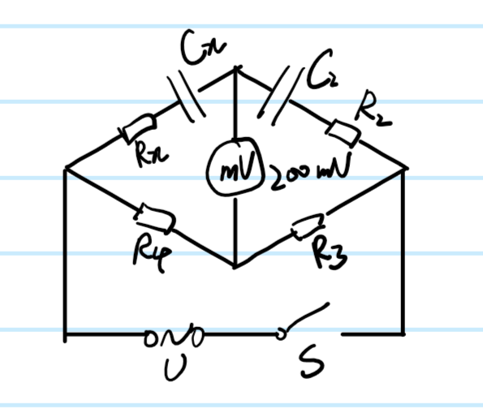
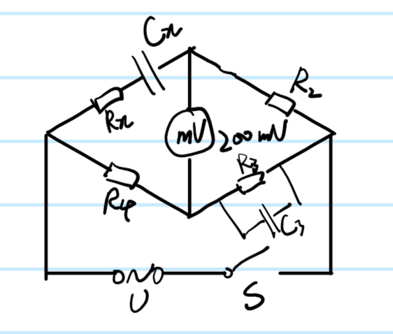

# 交流电桥测量电容与电感

## 一、实验目的

基于交流电桥平衡原理测量未知电容与电感。

## 二、实验器材

电阻箱三个，电容箱一个，直流稳压电源一个，数字万用表一块，信号发生器一个，开关一个，导线若干。

## 三、实验原理

电容测量电路如图，其中电桥平衡条件为：
    $$
        R_x=\frac{R_4}{R_3}R_2
        \\C_x=\frac{R_3}{R_4}C_2
    $$

电感测量电路如图，其中电桥平衡条件为：
    $$
        R_x=\frac{R_4}{R_3}R_2
        \\C_x=R_2R_4C_3
    $$

## 四、实验步骤

1. 用信号发生器当作交流电源，如电容测量电路图连接电路，断开开关，数字万用表取200mV电压档，
2. 闭合开关