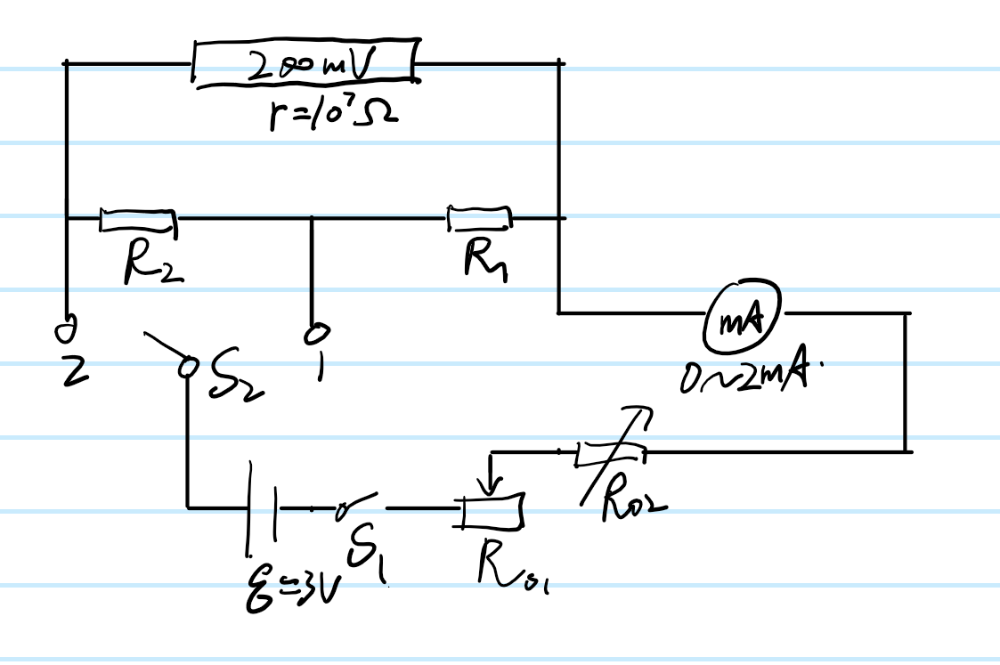

# 数字万用表的双量程改装

## 一、实验目的

利用数字万用表的 $200mV$ 档改装 $200\mu{A}$ 与 $2mA$ 档的电流表，并进行校准，确定改装表的准确度等级。

## 二、实验器材

直流稳压电源一个、电阻箱三个、滑动变阻器一个、单刀单掷开关三个，数字万用表两个，导线若干。

## 三、实验原理

如上图设计电路
根据欧姆定律计算出 $R_1$ 与 $R_2$ 的理论值，公式为：
    $$
        R_1=\frac{I_1Ur}{I_1(I_2r-U)}
        \\R_2=\frac{(I_1-I_2)Ur}{I_1(I_2r-U)}
    $$

其中 $I_1$ 与 $I_2$ 分别为 $S_2$ 接 $R_1$ 与 $R_2$ 时对应的改装表希望改成的电流表量程，$r$ 为待改装电压表内阻，$U$ 为待改装电压表最大量程。

## 四、实验步骤

1. 如图连接电路，断开开关，$R_{01}$ 与 $R_{02}$ 阻值取最大值，电源电动势取 $3V$.
2. 闭合开关 $S_1$，开关 $S_2$ 接 $1$ 端，调节 $R_{01}$ 与 $R_{02}$ 的值使得标准毫安表满偏（此时满偏应为 $I_1$=2${mA}$），调节 $R_1$ 的阻值使得改装表也满偏，记下此时的 $R_1$ 值。
3. 开关 $S_2$ 接 $2$ 端，调节 $R_{01}$ 与 $R_{02}$ 的值使得标准毫安表满偏（此时满偏应为 $I_2$=200$\mu{A}$）,调节 $R_2$ 的阻值使得改装表也满偏，记下此时的 $R_2$ 值。
4. 校准表。调节 $R_{01}$ 与 $R_{02}$ 的值使标准表的示数从满偏逐渐递减，每递减满量程的 10% 记录改装表的相应示数，并计算标准表与改装表的示数差值。
5. 根据计算出的最大差值对表的等级进行标定。

## 五、实验数据

$r=10^7\Omega$
$I_1=2.000mA$
$I_2=0.200mA=200\mu{A}$
$R_{1(理论)}=100.0\Omega$
$R_{2(理论)}=900.9\Omega$
$R_{1(实验)}=99.5\Omega$
$R_{2(实验)}=888.3\Omega$
|校准200$\mu{A}$档位|1|2|3|4|5|6|7|8|9|10|11|
|----|----|----|----|----|----|----|----|----|----|----|----|
|标准表示数$I_{标}$/$mA$|0.199|0.180|0.160|0.140|0.120|0.100|0.080|0.060|0.040|0.020|0.000|
|改装表示数$I_{改}$/$\mu{A}$|199.2|180.1|160.3|140.2|120.6|100.5|80.6|60.6|40.7|20.8|0.5|
|差值$\Delta{I}$/(换算为$\mu{A}$)|0.2|0.1|0.3|0.2|0.6|0.5|0.6|0.6|0.7|0.8|0.5|
$\Delta{I}_{max}=0.8\mu{A}$
$\displaystyle相对误差=\frac{\Delta{I}_{max}}{I_2}=0.4\%$
$\alpha=±0.5$
|校准2$m{A}$档位|1|2|3|4|5|6|7|8|9|10|11|
|----|----|----|----|----|----|----|----|----|----|----|----|
|标准表示数$I_{标}$/$mA$|1.999|1.800|1.600|1.400|1.200|1.000|0.800|0.600|0.400|0.200|0.000|
|改装表示数$I_{改}$/$\mu{A}$|1.999|1.800|1.600|1.400|1.200|1.000|0.798|0.599|0.399|0.199|0.000|
|差值$\Delta{I}$/$mA$|0.000|0.000|0.000|0.000|0.000|0.000|0.002|0.001|0.001|0.001|0.000|
$\Delta{I}_{max}=0.002mA$
$\displaystyle相对误差=\frac{\Delta{I}_{max}}{I_1}=0.1\%$
$\alpha=±0.1$

## 六、误差分析

用于改表的并联电阻箱精度较低，可能影响改装后的表的准确度。

## 七、结论

该改装后的电流表具有 $2mA$ 与 $200\mu{A}$ 两个量程，其准确度等级分别为 $±0.1$ 与 $±0.5$.