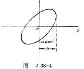

# 电学实验总结1

$$
    \newcommand{dbar}{\mathrm{d}\kern{-4.3pt}\bar{\small\phantom{q}}\kern{-0.7pt}}
    \newcommand{d}{\mathrm{d}}
    \newcommand{p}{\partial}
    \newcommand{l}{\left}
    \newcommand{r}{\right}
    \newcommand{<}{\langle}
    \newcommand{>}{\rangle}
$$

## 1.示波器相关的所有实验

### (1).超声波测量声速

首先要调节信号发生器使示波器上图像的振幅最大（调节谐振频率）；调整长度时要单向旋转鼓轮，防止回程误差。

#### 共振干涉法

入射超声波与反射超声波形成驻波，利用驻波测量波长。
原理：
    $$
        y_1=A\cos(\omega{t}-kx)
        \\y_2=A\cos(\omega{t}+kx+\pi)
        \\y=y_1+y_2=2A\sin(kx)sin(\omega{t})
    $$

测量多个波节/波腹的位置坐标，用最小二乘法作线性拟合得到波长，再利用 $u=f\lambda$ 计算出声速。

#### 相位比较法

利用 $y=y_0\cos(\omega{t}-kx+\varphi_0)$，其中 $\displaystyle k=\frac{2\pi}{\lambda}$，于是我们可以看到在x处的超声波与初始处的存在一个大小为 $\Delta\varphi=\displaystyle\frac{2\pi{x}}{\lambda}$ 的相位差。利用李萨如图形，我们可以判断 $\Delta\varphi=2n\pi$（亦即 $x=n\lambda$）时的位置，对这些位置进行记录并作线性拟合，我们就可以得到波长 $\lambda$ 的表达式，进而利用 $u=f\lambda$ 得到声速。

p.s. 声速随温度变化的表达式：
    $$
        u=\sqrt{\frac{\gamma{R}T}{\mu}}
    $$

其中 $\gamma$ 是绝热常数，$\mu$ 是气体摩尔质量。

### (2).示波器测电容、电感

公式：
    $$
        \Delta\varphi=\arctan(\frac{\omega{L}}{R})
        \\\Delta\varphi=\arctan(\omega{C}R)
    $$

测相位差的方法：
1.利用李萨如图形

如图，则 $\Delta\varphi=\arcsin\displaystyle\frac{a}{b}$ 即为相位差。

2.直接看示波器图像

3.利用示波器的add和CH2.inv模式，得到二者的差的图像，然后依据余弦定理计算相位差。

## 2.电桥相关实验

直流/交流电桥平衡条件就不写了，我自己知道。

不确定度的计算：
    $$
        \frac{U_X}{X}=\sqrt{\l(\frac{U_{Z_2}}{Z_2}\r)^2+\l(\frac{U_{Z_3}}{Z_3}\r)^2+\l(\frac{U_{Z_4}}{Z_4}\r)^2+\l(\frac{\Delta{V_{\min}}}{\sqrt{3}S}\r)^2}
    $$

其中：
    $$
        S\equiv\frac{\d{V}}{\d{R}}=\frac{S_vE}{(Z_2+Z_3+Z_4+Z_x)+R_v\l[2+\frac{Z_3}{Z_x}+\frac{Z_2}{Z_4}\r]}
    $$

$Z_2$ 为测量臂，$Z_3$ 与 $Z_4$ 为比例臂。
由上述公式可以看出，桥臂电阻越大，桥路灵敏度越低；示零电表精度与电源电动势越大，桥路灵敏度越高。
