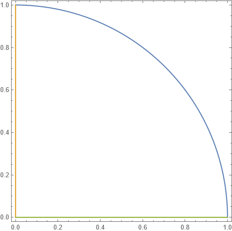

# 复变函数基础知识

## 区域

区域的定义：
 复平面上的点集，若满足以下条件，则称为区域：
  1.点集中的每一个点总可以找到一个邻域，使得该邻域中的所有点都属于该点集。
  2.点集是连通的，即对于点集中的任何两点总可用某段曲线段连接起来，且该线段上的点都属于该点集。
包括境界线的区域称为闭区域；不包括境界线的区域称为开区域，简称区域。区域境界线的正方向为使区域在境界线左侧的方向。

## 解析函数

对于区域上的连续函数 $f(z)$ ，其为解析的充要条件为Cauchy-Riemann条件，即：

$$\begin{aligned}\frac{\partial u(x,y)}{\partial x}&=\frac{\partial v(x,y)}{\partial y}\\\frac{\partial v(x,y)}{\partial x}&=-\frac{\partial u(x,y)}{\partial y}\end{aligned}$$

## 解析函数的几何性质与保角变换

考虑一个在区域D内解析的导数不为0的函数。
该函数构成一个保角变换。其某点曲线微元的放大率为导函数在某点的绝对值；转过的角度为该点导函数的幅角。原本某一点的两曲线微元在经过这样的变换后夹角不变，故称为保角变换。

## 解析函数的物理解释

由Cauchy-Riemann条件可知，任意解析函数的实部和虚部都是（二维）调和函数。我们称同一个解析函数的实部和虚部为共轭调和函数。注意到平面静电场的电势函数也是二维调和函数，所以我们可以将解析函数的实部（或虚部）解释为平面静电场的势。

## 复变函数积分

对复平面上的一条起点A终点B的有向曲线段，将其分为n个小段，每小段为 $\Delta z_k$ 。在每小段上取一点 $\zeta_k$ ，对于函数 $f(z)$ ，其在该曲线段上的积分定义为：

$$\int_l f(z)\:\mathrm{d}z\equiv\lim_{max|\Delta z_k|\:\rightarrow\:0}\sum_{k\:=\:1}^nf(\zeta_k)\Delta z_k$$

将 $z$ 与 $f(z)$ 的代数式写出后，可以知道一个复变函数的积分相当于两个二元实变函数的曲线积分：

$$\int_l f(z)\:\mathrm{d}z=\int_l(u\:\mathrm{d}x-v\:\mathrm{d}y)+i\int_l(v\:\mathrm{d}x+u\:\mathrm{d}y)$$

## Cauchy定理

### 单通区域与复通区

境界线是一条简单闭曲线的是单通区域，境界线多于一条闭曲线的是复通区域。

### Cauchy定理一

设 $f(z)$ 是由境界线l所围的闭单通区域 $\bar{D}$ 上的解析函数，则：

$$\oint_lf(z)\:\mathrm{d}z=0$$

由该定理我们可以得到如下推论：
 在单通区域内，解析函数积分的值仅与积分曲线两端点的位置有关，而与积分路径无关。

### Cauchy定理二

设 $l_k$ 是复通区域 $D$ 的全部境界线， $f(z)$ 是 $\bar D$ 上的单值解析函数，则有：

$$\sum_{k\:=\:1}^n\oint f(z)\:\mathrm{d}z=0$$

推论：
 1.复通区域内单值函数沿外境界线逆时针方向的积分等于沿各内境界线逆时针方向积分之和。
 2.对于闭区域上的解析函数，一条闭曲线可在区域内连续变形而保证在其上的积分保持不变。

## 不定积分

设 $f(z)$ 是单通区域 $D$ 内的解析函数，$z_0$ 是 $D$ 内的一个定点，在 $D$ 内定义函数：

$$F(z)\equiv\int^z_{z_0}f(\zeta)\:\mathrm{d}\zeta$$

则 $F(z)$ 也是 $D$ 内的解析函数，且：

$$F'(z)=f(z)$$

同时，对 $D$ 内任意的两点 $z_1$ 和 $z_2$ 有：

$$\int^{z_2}_{z_1}=F(z_2)-F(z_1)$$

即 $F(z)$ 是 $f(z)$ 的原函数。
于是，$f(z)$ 的原函数的集合 $\{\:F(z)+C\:\}$ 称为 $f(z)$ 的不定积分。

## Cauchy公式

考虑

$$I=\oint(z-\alpha)^{-1}\:\mathrm{d}z$$

有Cauchy定理的推论，我们可以将积分路线改为圆周 $|z-\alpha|=\varepsilon$ ，并令 $z=\alpha+\varepsilon e^{i\varphi}$ ，于是有 $\mathrm{d}z=i\varepsilon e^{i\varphi}\mathrm{d}\varphi$ ，于是有：

$$I=\int_0^{2\pi}\frac{i\varepsilon e^{i\varphi}\mathrm{d}\varphi}{\varepsilon e^{i\varphi}}=2\pi i$$

设 $f(z)$ 是闭单连通区域上的解析函数， $l$ 为区域的境界线，对区域内的任一点 $z$，我们可知：

$$f(z)=\frac{1}{2\pi{i}}\oint\frac{f(z)}{\zeta-z}\:\mathrm{d}\zeta$$

然后利用Cauchy定理的推论经过一番fancy的缩小围道到无穷小半径的圆的操作，我们可以证明：

$$f(z)=\frac{1}{2\pi{i}}\oint_l\frac{f(\zeta)}{\zeta-z}\:\mathrm{d}\zeta$$

该式即为Cauchy公式。
Cauchy公式有以下推论：
 1.解析函数的高阶导数：
 $$f^{(n)}(z)=\frac{n!}{2\pi{i}}\oint\frac{f(\zeta)}{(\zeta-z)^{n+1}}\:\mathrm{d}\zeta$$
 2.无界区域上的Cauchy公式：
  考虑 $f(z)$ 在闭曲线 $l$ 上及其外部的无界区域上是解析的，且有：
  $$\lim_{z\:\rightarrow\:\infty}f(z)=0$$
  则Cauchy公式仍然成立。

## 留数定理与定积分计算

### Laurent级数

 Laurent定理：设 $f(z)$ 在环形区域 $R_2<|z-b|<R_1$ 内是单值解析的，则 $f(z)$ 可在此环域内展开为绝对收敛且一致收敛的级数：

 $$f(z)=\sum^\infty_{k\:=\:-\infty}a_k(z-b)^k$$

其中：

$$a_k=\frac{1}{2\pi{i}}\oint_l\frac{f(\zeta)}{(\zeta-b)^{k+1}}\:\mathrm{d}\zeta$$

该级数称为Laurent级数。

### 孤立奇点

假定 $f(z)$ 在点 $z=b$ 是孤立的，即在该点的任意小邻域内除该点外无其他奇点，并将该函数以 $b$ 点为中心在其邻域内展开为Laurent级数。对于该展开式，我们将它的正幂部分称为它的解析部分，而负幂部分称为主要部分。
孤立奇点的分类：
 1.可去奇点：
  若Laurent级数的主要部分不存在，则称 $z=b$ 为 $f(z)$ 的可去奇点，此时 $f(z)$ 在该点的极限为一有限复数。
 2.极点
  若Laurent级数的主要部分仅有有限项，即：
  $$f(z)=\sum^\infty_{k\:=\:-m}a_k(z-b)^k\qquad(0<|z-b|<R_1)$$
  其中 $m\geq1$ 且 $a_{-m}\neq0$ ，则称 $z=b$ 为 $f(z)$ 的$m$阶极点。特别的，$m=1$时的极点也被称为单极点。此时 $f(z)$ 在该点的极限为无穷。
  关于极点阶数的判断：
   使 $\lim_{z\:\rightarrow\:b}[(z-b)^nf(z)]$ 取非零有限值的自然数 $n$ 即为该极点得阶数。
 3.本性奇点
  若Laurent级数的主要部分有无穷项，则称称 $z=b$ 为 $f(z)$ 的本性奇点。此时 $f(z)$ 在该点的极限不存在。
对于无穷远点的奇点，将Laurent的解析部分与主要部分的定义互换后再根据以上分类即可判断奇点的类型。

### 留数定理和留数的求法

留数定理：设 $f(z)$ 在由闭曲线 $l$ 所围的区域内除具有有限个奇点 $z=b_k\:(k=1,2,···,m)$ 外是单值解析的（或是多值函数的一个单值分支），在 $l$ 上也是解析的，则：

$$\oint_lf(z)\:\mathrm{d}z=2\pi{i}\sum^m_{k\:=\:1}a_{-1}^{(k)}\equiv2\pi{i}\sum^m_{k\:=\:1}Res\:f(b_k)$$

其中 $a_{-1}^{(k)}$ 是 $f(z)$ 在 $z=b_k$ 的邻域内Laurent级数展开的 $-1$ 次幂项的系数，特称为 $f(z)$ 在 $z=b_k$ 的留数，记为 $Res\:f(z)|_{z=b_k}$ 或 $Res\:f(b_k)$ .
留数的求法：
 1.可去奇点的留数为0.
 2.极点的留数：
  (1).设 $z=b$ 是 $f(z)$ 的单极点，有：$$Res\:f(b)=\lim_{z\:\rightarrow\:b}[(z-b)f(z)]$$若 $f(z)$ 可表示为两个解析函数 $P(z)$ 与 $Q(z)$ 之商，则：
  $$Res\:f(b)=\frac{P(b)}{Q'(b)}$$
  (2).设 $z=b$ 是 $f(z)$ 的 $m\:(m\geq2)$ 阶极点，有：
  $$Res\:f(b)=\lim_{z\:\rightarrow\:b}\frac{1}{(m-1)!}\frac{\mathrm{d}^{m-1}}{\mathrm{d}z^{m-1}}[(z-b)^mf(z)]$$
  (3).若 $z=b$ 是 $f(z)$ 的本性奇点，则只能由Laurent级数展开的系数求留数。

留数定理将闭曲线积分的计算变为（至多）求几个极点处的导数，这为我们求解许多没有初等原函数的实变函数的定积分提供了方便的方法。

### 单周期内三角函数有理分式的定积分计算

感觉用不到，不写了喵~

### $\displaystyle\int^\infty_{-\infty} f(x)\mathrm{d}x$ 与 $\displaystyle\int^\infty_{-\infty} f(x)e^{imx}\mathrm{d}x$ 的计算与Jordan引理

利用留数定理计算定积分，可以将其变为实数轴上的一个线段与复平面内一个适当辅助曲线段 $l_1$ 的围道积分。按照留数定理，我们有：

$$
\int^{a}_{b}f(x)\:\mathrm{d}x+\int_{l_1}f(z)\:\mathrm{d}z
=\oint_lf(z)\:\mathrm{d}z
=2 \pi i \sum_{k\:=\:1}^m Res\:f(b_k)
$$

这位我们计算定积分提供了途径。
1.考虑如下积分：

$$
\int^{\infty}_{-\infty}f(x)\:\mathrm{d}x
$$

设由 $f(x)$ 所唯一确定的解析函数 $f(z)$ 在上半平面仅有有限个奇点，而且当 $z\rightarrow\infty$ 时，$zf(z)$ 一致地趋于零（简记为 $zf(z)\Rightarrow0$ ）；暂且假设 $f(z)$ 在实轴上没有奇点，构建一以原点为圆心、充分大的 $R$ 为半径的上半圆 $C_R$，它与实轴上一段 $[-R,R]$ 构成一闭曲线 $l$，且将 $f(z)$ 在上半平面的奇点全部包括在内。于是有：

$$
\int^R_{-R}f(x)\:\mathrm{d}x+\int_{C_R}f(z)\:\mathrm{d}z=\oint_lf(z)\:\mathrm{d}z=2\pi{i}\sum_{上半圆内} Res\:f(z)
$$

当我们取极限 $R\rightarrow0$ 时，上式左端的第一项就是我们要求的积分。
由上述的 $zf(z)\Rightarrow0$ 的条件我们可以证明，上式的第二项在 $R\rightarrow0$ 时等于 $0$.
于是，我们有：

$$
\int^{\infty}_{-\infty}f(x)\:\mathrm{d}x=2\pi{i}\sum_{上半圆内}Res\:f(z)
$$

e.g.计算如下积分：

$$
I=\int^{\infty}_{0}\frac{\mathrm{d}x}{(x^2+1)^3}=\frac{1}{2}\int^{\infty}_{-\infty}\frac{\mathrm{d}x}{(x^2+1)^3}
$$

解：被积函数上半平面内仅有 $z=i$ 一个三阶极点。由于：

$$
Res\:f(i)=\frac{3}{16i}
$$

有:

$$
I=\frac{1}{2}2\pi{i}\frac{3}{16i}=\frac{3\pi}{16}
$$

2.考虑如下积分：

$$
\int^{\infty}_{-\infty}f(x)e^{imx}\:\mathrm{d}x
$$

其中 $m$ 是一个非零实数。
该积分的实部是：

$$
\int^{\infty}_{-\infty}cos(mx)\:\mathrm{d}x
$$

虚部是：

$$
\int^{\infty}_{-\infty}sin(mx)\:\mathrm{d}x
$$

不妨设 $m>0$ ，且由 $f(x)$ 所唯一确定的解析函数 $f(z)$ 在上半平面内仅有有限个奇点，而且当 $z\rightarrow0$ 时，$f(z)\Rightarrow0$ （这比上文中的 $zf(z)\Rightarrow0$ 弱），同上述方法取闭曲线 $l$ 为围道，于是有：

$$
\begin{aligned}
\int^{R}_{-R}&f(x)e^{imx}\:\mathrm{d}x+\int_{C_R}f(z)e^{imz}\:\mathrm{d}z\\
&=\oint_lf(z)e^{imz}\:\mathrm{d}z=2\pi{i}\sum_{上半圆内}Res[f(z)e^{imz}]
\end{aligned}
$$

接下来证明 $R\rightarrow0$ 时第二项积分趋近于0：

**Jordan引理**：设 $m>0$，且当 $z\rightarrow\infty$ 时 $f(z)\Rightarrow0(0\leq arg\:z\leq\pi)$，则：

$$
\lim_{R\:\rightarrow\:\infty}\int_{C_R}f(z)e^{imz}\:\mathrm{d}z=0
$$

证明：大概看懂了，懒得抄了，略。

推论：若上述条件中的 $m<0$，则 $C_R$ 应改成下班平面的大半圆，即 $\pi\leq arg\:z\leq2\pi$，此时上述引理仍旧成立。
利用Jordan引理并取 $R\rightarrow\infty$，即可得到：

$$
\int^{\infty}_{-\infty}f(x)e^{imx}\:\mathrm{d}x=2\pi{i}\sum_{上半平面}Res[f(z)e^{imz}]\quad(m>0)
$$

e.g.考虑如下积分：

$$
I=\int^{\infty}_{0}\frac{xsin\:mx}{x^2+a^2}\mathrm{d}x=\frac{1}{2}\int^{\infty}_{-\infty}\frac{xsin\:mx}{x^2+a^2}\mathrm{d}x
$$

（$m$是实常数，$a>0$）

解：设 $m>0$，且考虑如下积分：

$$
\int^{\infty}_{-\infty}\frac{x}{x^2+a^2}e^{imx}\:\mathrm{d}x
$$

由于被积函数在上半平面仅有一个单极点 $z=ai$，所以有：

$$
\int^{\infty}_{-\infty}\frac{x}{x^2+a^2}e^{imx}\:\mathrm{d}x=2\pi{i}Res\left.\left[\frac{z}{z^2+a^2}e^{imz}\right]\right|_{z=ai}=\pi{i}e^{-ma}
$$

取其虚部并除以二，即得：

$$
I=\frac{\pi}{2}e^{-ma}
$$

### 积分主值与Hilbert变换

#### 积分主值

在上文中，我们考虑的都是被积函数在积分区间内有界的情况。
接下来我们考虑被积函数在积分区间内无界的情况。
设 $z=c(a<c<b)$ 是 $f(z)$ 的单极点，广义积分 $\displaystyle\int_{a}^{b}f(x)\:\mathrm{d}x$的一般值定义为（$\varepsilon_1>0,\varepsilon_2>0$）：

$$
\int_{a}^{b}f(x)\:\mathrm{d}x\equiv\lim_{\varepsilon_1\:\rightarrow\:0}\int^{c-\varepsilon_1}_{a}f(x)\:\mathrm{d}x+\lim_{\varepsilon_2\:\rightarrow\:0}\int^{b}_{c+\varepsilon_2}f(x)\:\mathrm{d}x
$$

而积分主值记为 $P\int^b_af(x)\:\mathrm{d}x$ 并定义为（$\varepsilon>0$）：

$$
P\int^b_af(x)\:\mathrm{d}x\equiv\lim_{\varepsilon\:\rightarrow\:0}\left[\int^{c-\varepsilon}_af(x)\:\mathrm{d}x+\int^b_{c+\varepsilon}f(x)\:\mathrm{d}x\right]
$$

经过一番fancy的推导，我们可以得到：

$$
P\int_{-\infty}^{\infty}f(x)\:\mathrm{d}x=2\pi{i}\sum_{上半平面}Res\:f(z)+\pi{i}\sum_{实轴上}Res\:f(z)
$$

##### Hilbert变换

考虑如下积分：

$$
I=\int^{\infty}_{-\infty}\frac{f(x)}{x-\alpha}\:\mathrm{d}x
$$

其中 $f(z)$ 在上半平面内处处解析，且当 $z\rightarrow\infty$ 时 $f(z)\Rightarrow0(0\leq arg\:z\leq\pi)$， $\alpha$ 是一个实数。则有：

$$
P\int^{\infty}_{-\infty}\frac{f(x)}{x-\alpha}\:\mathrm{d}x=\pi{i}f(\alpha)
$$

分离出实部和虚部，有：

$$
\left\{
 \begin{aligned}
  Ref(\alpha)&=\frac{1}{\pi}P\int^{\infty}_{-\infty}\frac{Imf(x)}{x-\alpha}\:\mathrm{d}x\\
  Imf(\alpha)&=-\frac{1}{\pi}P\int^{\infty}_{-\infty}\frac{Ref(x)}{x-\alpha}\:\mathrm{d}x
 \end{aligned}
\right.
$$

该关系式称为Hilbert变换。

### 特殊积分

Fresnel积分：

$$
I_1=\int^{\infty}_0sin\:x^2\:\mathrm{d}x \quad I_2=\int^{\infty}_0cos\:x^2\:\mathrm{d}x
$$

考虑函数 $f(z)=e^{iz^2}$ 沿一条闭曲线的积分。接下来考虑闭曲线的选取问题。取 $z=Re^{i\theta}$ 若我们仍旧像前文一样选取上半圆作为围道，就会有：

$$
e^{iz^2}=e^{-R^2sin\:2\theta}e^{iR^2cos\:2\theta}
$$

此时取 $R\rightarrow\infty$，则对于 $\displaystyle\theta\in(\frac{\pi}{2},\pi)$ 的情况，就会有上式趋近于无穷大，因而上半圆围道不满足我们的需求。
于是考虑右上四分之一圆围道（如图）。

此时我们就有：

$$
\int_{C'_R}f(z)\:\mathrm{d}z\rightarrow0\quad(R\:\rightarrow\:\infty)
$$

利用Cauchy定理，我们有：

$$
\int^R_0e^{ix^2}\mathrm{d}x+\int_{C'_R}f(z)\mathrm{d}z+\int^0_Re^{-iy^2}dy=0
$$

取 $R\rightarrow\infty$ 有：

$$
(I_2+iI_1)-i(I_2-iI_1)=0
$$

于是有 $I_1=I_2$.
但这并没有解决问题，因为我们仍不知道 $I_1$ 与 $I_2$的值。
于是再考虑取 $\displaystyle\frac{1}{8}$ 圆为围道做积分。这样的好处在于 $f(z)$ 沿 $\displaystyle z=re^{\frac{i\pi}{4}}$ 的积分是我们已知的：

$$
\int^{\infty}_{0}e^{iz^2}\:\mathrm{d}z=e^{\frac{i\pi}{4}}\int^{\infty}_{0}e^{-r^2}\:\mathrm{d}r=\frac{\sqrt{\pi}}{2}\left(\frac{\sqrt{2}}{2}+i\frac{\sqrt{2}}{2}\right)
$$

将该项替换掉上式中对 $y$ 的积分，我们有：

$$
\int^{\infty}_{0}e^{ix^2}\:\mathrm{d}x-\frac{\sqrt{\pi}}{2}\left(\frac{\sqrt{2}}{2}+i\frac{\sqrt{2}}{2}\right)=0
$$

于是有：

$$
I_1=I_2=\frac{\sqrt{2\pi}}{4}
$$
