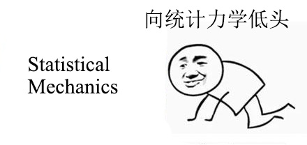

# Chapter 1 统计物理学的基本原理

>注：本文为笔者学习朗道《统计物理学I》过程中的笔记与相关内容的补充。笔者是初学者，文章内容如有错误，欢迎指正。

## 一、经典统计

### 1.统计分布——相空间、子系统、分布函数与统计平衡

#### (1).相空间

&emsp;&emsp;假设我们所考虑的宏观力学系统有 $s$ 个自由度，那么这个系统的各点空间位置由 $s$ 个坐标表征。我们将这些坐标记为 $q_i$，角标 $i$ 取 $1,2,...,s$.
&emsp;&emsp;与 Hamilton 力学类似，我们使用 $s$ 个坐标 $q_i$ 与 $s$ 个动量 $p_i$ 来刻画一个系统的状态。系统的不同状态在数学上可以用相空间中不同的点来表示。该空间的坐标轴上标出的是该系统的坐标与动量。因此，每一个系统都有自己独特的相空间，该相空间的维数等于系统自由度的两倍，即 $2s$. 相空间中的每一点，对应于系统一组确定的坐标值 $q_i$ 与动量值 $p_i$，因而代表这个系统的一个确定的状态。系统的状态随时间演化，表征状态的点就将在相空间中描画出一条曲线，称为相轨道。

#### (2).子系统与各态历经假说

&emsp;&emsp;考虑任意的宏观物体或物体系统。假设系统是闭合的，即该系统与任何其他物体都不产生相互作用。从该系统中划分出某一部分，该部分与整个系统相比非常小，但仍旧是一个宏观系统。这种相对非常小但仍旧宏观的部分称为子系统。子系统并不闭合，它受到来自整个系统其余各部分的复杂而紊乱的相互作用，因而其状态也随着时间以十分复杂紊乱的方式变化。
&emsp;&emsp;精确求解子系统是不现实的。但可以利用子系统的复杂与紊乱性来进行子系统行为的求解。引入各态历经假说的基本思想：由于被我们划分出来的子系统与系统其他部分的相互作用极其复杂且紊乱，以至于在足够长的时间间隔内，子系统会在自身所有可能的状态中经历足够多的次数。
&emsp;&emsp;用 $\Delta p\Delta q$ 表示当子系统的坐标 $q_i$ 与动量 $p_i$ 的值位于小间隔 $\Delta q_i$ 与 $\Delta p_i$ 内时，其在相空间某个小区域的“体积”。在足够长的时间 $T$ 内，子系统的十分复杂紊乱的相轨道会多次穿过其相空间中每一个这样的区域。
&emsp;&emsp;设在总时间 $T$ 内，子系统处于相空间中给定区域 $\Delta p\Delta q$ 内的那一段时间为 $\Delta t$. 当总时间 $T$ 无限增大时，比值 $\displaystyle\frac{\Delta t}{T}$ 将趋于某个极限值：
    $$
        \omega=\lim_{T\:\rightarrow\:\infty}\frac{\Delta t}{T}
    $$
显然可以将该数值看作当我们在某任意时刻观测子系统时发现它处于相空间中给定区域 $\Delta p\Delta q$ 内的概率。

#### (3).分布函数

&emsp;&emsp;当相空间中的体积元变为无限小时，记：
    $$
        \mathrm{d}q\mathrm{d}p=\prod \limits_{i=1}^s\mathrm{d}q_i\mathrm{d}p_i
    $$
引入 $\mathrm{d}\omega$ 来表示该体积元中的相点所代表的状态的概率，即系统位于给定 $q_i$，$p_i$ 与 $q_i+\mathrm{d}q_i$，$p_i+\mathrm{d}p_i$ 之间的无限小间隔内的概率。可以将其写为：
    $$
        \mathrm{d}\omega=\rho(p_1,\dotsb,p_s,q_1,\dotsb,q_s)\mathrm{d}p\mathrm{d}q
    $$
函数 $\rho$ 表征相空间中概率分布“密度”的作用，称为该系统的统计分布函数，简称分布函数。显然，分布函数应当满足“归一化条件”：
    $$
        \int{\rho}\mathrm{d}p\mathrm{d}q=1
    $$
积分遍布整个相空间。
&emsp;&emsp;由于子系统经历了足够长的时间，遍历了足够多的状态，其初始状态的影响已然被系统中其余更大部分的影响所完全消除。因而，某一子系统的统计分布与整个系统的任意部分（包括子系统自己）的初始条件无关。
&emsp;&emsp;若已经求得了子系统的统计分布，则我们便可以把任何依赖于子系统状态的物理量的不同取值的概率计算出来。获得概率后，我们便可计算该物理量的平均值：只要把所有可能值乘以相应概率，遍历全状态积分即可：
    $$
        {\langle}f{\rangle}=\int{f(p,q)\rho(p,q)}\mathrm{d}p\mathrm{d}q
    $$
显然，利用概率求统计平均完全等价于无限长时间内的时间平均。

#### (4).统计平衡

&emsp;&emsp;由上文可知，统计学给出的宏观物体行为的结论与预言具有概率性。然而在现实应用中，其概率性往往难以显现出来。这是由于如果我们在足够长的时间间隔内观测任何一个宏观物体，就会发现：所有表征这个物体的物理量实际上都是常量（等于其平均值）。由此可见，统计学的预言从应用上来说实际上是确定的，而非概率的。
&emsp;&emsp;如果一个闭合宏观系统在其所处的状态下，其任何宏观子系统的宏观物理量都充分精确地等于相应量的平均值，就说系统处于统计平衡态（亦即热力学平衡，或热平衡状态）。若一个闭合体系暂时不处在统计平衡状态，则其需要一段时间过渡到统计平衡状态。该段时间被称为弛豫时间。而上述“足够长的时间间隔”指的就是远长于弛豫时间的时间间隔。
&emsp;&emsp;与过渡到平衡态有关的过程理论，称为动理学，我们不在此讨论。

### 2.统计独立

#### (1).统计独立性

&emsp;&emsp;在第一节中讨论的子系统并不是闭合的。但由于它们本身仍旧是宏观物体，所以我们总可以在一个不太长的时间间隔内，认为其行为近似于闭合系统。当子系统足够大时，它与周围部分相互作用的能量比子系统的内能要小得多。因此，我们可以说子系统在不太长的时间间隔内是“准闭合”的。各个子系统之间的相互作用是如此的微弱以至于我们可以认为其在统计意义上是独立的。
&emsp;&emsp;统计独立性意味着：一个子系统所处的状态不影响其它子系统处于不同状态的概率。

#### (2).涨落

&emsp;&emsp;考虑任意两个子系统，并设 $\mathrm{d}p^{(1)}\mathrm{d}q^{(1)}$ 和 $\mathrm{d}p^{(2)}\mathrm{d}q^{(2)}$ 表示他们的相空间体积元。若将两个子系统的集合看成一个组合的子系统，则从数学上来讲，统计独立性就意味着组合子系统处于其相体积元 $\mathrm{d}p^{(12)}\mathrm{d}q^{(12)}=\mathrm{d}p^{(1)}\mathrm{d}q^{(1)}·\mathrm{d}p^{(2)}\mathrm{d}q^{(2)}$ 的概率，可以分解为每个子系统分别处于 $\mathrm{d}p^{(1)}\mathrm{d}q^{(1)}$ 和 $\mathrm{d}p^{(2)}\mathrm{d}q^{(2)}$ 中的概率的乘积，即：
    $$
        \rho_{12}\mathrm{d}p^{(12)}\mathrm{d}q^{(12)}=\rho_{1}\mathrm{d}p^{(1)}\mathrm{d}q^{(1)}·\rho_{2}\mathrm{d}p^{(2)}\mathrm{d}q^{(2)}
    $$
或：
    $$
        \rho_{12}=\rho_{1}\rho_{2}
    $$
对于多个子系统的集合也可以写出类似的关系式。
&emsp;&emsp;显然该定理的逆定理也成立：若一个复合系统的概率分布可以分解成几个因子的乘积，且每个因子仅与复合系统的其中一部分相关，则说明该系统的各个部分之间有统计独立性关系，且每个因子正比于相应部分的状态概率。
&emsp;&emsp;若 $f_1$ 和 $f_2$ 是两个属于不同子系统的物理量，那么由统计独立性与平均值定义可以直接得到：
    $$
    \begin{aligned}
        {\langle}f_{1}{\rangle}·{\langle}f_{2}{\rangle}&=\int{f_{1}\rho_{1}}\mathrm{d}p^{(1)}\mathrm{d}q^{(1)}·\int{f_{2}\rho_{2}}\mathrm{d}p^{(2)}\mathrm{d}q^{(2)}
        \\&=\int{f_{1}f_{2}\rho_{12}}\mathrm{d}p^{(12)}\mathrm{d}q^{(12)}
        \\&={\langle}f_{1}f_{2}{\rangle}
    \end{aligned}
    $$
&emsp;&emsp;考察某一宏观物体或其某一部分的任意一个物理量 $f$，该物理量随时间变化，在其平均值附近摆动。我们希望引入一个量来衡量其偏离均值的平均幅度。
&emsp;&emsp;首先想到差值 $\Delta{f}=f-{\langle}f{\rangle}$ 的平均值，但它显然并不适用。因为差值的双向性，导致其平均值总会为零。
&emsp;&emsp;进一步考虑差值的平方的平均值。考虑平方的好处在于 $(\Delta{f})^2$ 总是正的，因而只有在其本身趋于零时，该值的均值才会趋于零。因此，我们将 $\sqrt{{\langle}(\Delta{f})^2{\rangle}}$ 称为物理量 $f$ 的方均根涨落。将平方值展开，我们有：
    $$
    \begin{aligned}
        {\langle}(\Delta{f})^2{\rangle}&={\langle}(f-{\langle}f{\rangle})^2{\rangle}
        \\&={\langle}(f^2-2f{\langle}f{\rangle}+({\langle}f{\rangle})^2){\rangle}
        \\&={\langle}f^2{\rangle}-({\langle}f{\rangle})^2
    \end{aligned}
    $$
即一个物理量的方均根涨落取决于其平方平均值与平均值的平方的差。
&emsp;&emsp;定义
    $$
        \frac{\sqrt{{\langle}(\Delta{f})^2{\rangle}}}{{\langle}f{\rangle}}
    $$
为 $f$ 这个量的相对涨落。相对涨落越小，则 $f$ 极大偏离平均值的时间就越少。

#### p.s.宏观体系的物理量足够精确地等于其统计平均的证明

&emsp;&emsp;接下来我们将证明：物理量的相对涨落随着他们所从属的体系的粒子数的增加而迅速减小，且在足够大的粒子数情况下趋于零。我们在此考虑的物理量均为可加量，即：整个物体的该物理量值等于该物体各部分的该物理量值之和。这一性质是子系统准闭合性的结果。
&emsp;&emsp;设 $f$ 为我们考虑的该种可加物理量。将我们所考虑的系统分为数目很大的 $N$ 个相同的小部分，于是有：
    $$
        {\langle}f{\rangle}=\sum\limits_{i=1}^{N}{\langle}f_{i}{\rangle}
    $$
随着物体尺度的增加，对于相同大小的小部分，$N$ 会显著的增加，而 ${\langle}f{\rangle}$ 大致与 $N$ 成正比地增长。接下来，我们来确定 $f$ 的方均根涨落。
首先有：
    $$
    \begin{aligned}
        \Delta{f}&=f-{\langle}f{\rangle}
        \\&=\sum\limits_{i=1}^{N}{f_i}-\sum\limits_{i=1}^{N}{\langle}f_{i}{\rangle}
        \\&=\sum\limits_{i=1}^{N}(f_i-{\langle}f_{i}{\rangle})
        \\&=\sum\limits_{i=1}^{N}{\langle}\Delta{f_{i}}{\rangle}
    \end{aligned}
    $$
于是有：
    $$
    \begin{aligned}
        {\langle}(\Delta{f})^2{\rangle}&=\left\langle\left(\sum\limits_{i=1}^{N}\Delta{f_{i}}\right)^2\right\rangle
        \\&=\left\langle\sum\limits_{i=1}^{N}\left(\Delta{f_{i}}\right)^2+\sum\limits_{i\ne j}\Delta{f_i}\Delta{f_j}\right\rangle
        \\&=\sum\limits_{i=1}^{N}\left\langle\left(\Delta{f_{i}}\right)^2\right\rangle+\sum\limits_{i\ne j}\left\langle\Delta{f_i}\Delta{f_j}\right\rangle
    \end{aligned}
    $$
由于：
    $$
        {\langle}\Delta{f_i}·\Delta{f_j}{\rangle}={\langle}\Delta{f_i}{\rangle}·{\langle}\Delta{f_j}{\rangle}=0\quad(i\ne j)
    $$
（每个 ${\langle}\Delta{f_i}{\rangle}$ 均为零），于是有：
    $$
        {\langle}(\Delta{f})^2{\rangle}=\sum\limits_{i=1}^{N}\left\langle\left(\Delta{f_{i}}\right)^2\right\rangle
    $$
于是有：当 $N$ 增加时，方均根涨落 ${\langle}(\Delta{f})^2{\rangle}$ 也将与 $N$ 成正比地增加。于是有：
    $$
        \frac{\sqrt{{\langle}(\Delta{f})^2{\rangle}}}{{\langle}f{\rangle}}\propto\frac{\sqrt{N}}{N}=\frac{1}{\sqrt{N}}
    $$
即相对涨落与 $\sqrt{N}$ 成反比。
&emsp;&emsp;显然，若认为分块的大小都是均匀一致，则 $N$ 与粒子数成正比。于是，当粒子数足够大时，我们有理由认为 $f$ 本身已经是不随时间变化的常量。

### 3.刘维尔定理

#### (1).统计系综

&emsp;&emsp;假定在一段很长的时间内观测某个子系统。将时间划分为极大量同样大小的时间间隔，其分界点为 $t_1,t_2,\dotsb$ 时刻。在每一个这样的时刻，我们研究的子系统都位于相空间中的某一点，记为 $A_1,A_2,\dotsb$. 这样的点的集合以一定密度分布在相空间中。在时间趋于正无穷的极限情况下，相空间每一处的密度都与分布函数 $\rho(p,q)$ 成正比。考虑到分布函数的意义，这一点是显然的。
&emsp;&emsp;由于子系统的统计独立性，我们可以用考察大量（极限情况无穷大）、完全等同的子系统于同一时刻分别处于相点 $A_1,A_2,\dotsb$ 所代表的状态，来替代考察单个子系统在不同时刻$t_1,t_2,\dotsb$ 所处的状态。这样大量的假想全同子系统的集合称为统计系综。

#### (2).刘维尔定理

&emsp;&emsp;接下来追踪这些子系统之后一小段时间间隔的时间演化。取一小段时间间隔是为了保证子系统的准闭合性，这样就只用考虑每个子系统而无需涉及系统间的相互作用。
&emsp;&emsp;显然，在任何时刻 $t$，所有的相点仍旧按照同一个分布函数 $\rho(p,q)$ 分布在相空间中。即使 $t$ 发生变化，相点的分布仍然遵循分布函数 $\rho(p,q)$.
&emsp;&emsp;上述的情况可以看作相空间中稳定的“气流”。因此，我们可以对它应用表示“气体粒子”（在这里是相点）总数不变的连续性方程。
&emsp;&emsp;我们所熟知的连续性方程为：
    $$
        \frac{\partial{\rho}}{\partial{t}}+\nabla·(\rho\mathbf{v})=0
    $$
对于稳定的气流，显然分布函数不显含时间，即 $\displaystyle\frac{\partial{\rho}}{\partial{t}}=0$，于是有：
    $$
        \nabla·(\rho\mathbf{v})=0
    $$
推广到 $2s$ 维空间，有：
    $$
        \partial_i(\rho v^i)=0
    $$
（$\partial_i$ 默认是对 $x^i$ 求导，书写上使用了爱因斯坦求和约定，其中 $i$ 取从 $1$ 到相应维数。）
&emsp;&emsp;显然，在相空间中，“坐标” $x^i$ 是坐标 $q$ 与动量 $p$，而“速度” $v^i=\dot{x}^i$ 是相应坐标与动量对时间的导数 $\dot{p}$ 和 $\dot{q}$. 于是有：
    $$
        \partial_{q^i}(\rho\dot{q}^i)+\partial_{p^i}(\rho\dot{p}^i)
    $$
将上式展开，即有：
    $$
        \sum\limits_{i=1}^{s}\left(\dot{q}^i\frac{\partial{\rho}}{\partial{q^i}}+\dot{p}^i\frac{\partial{\rho}}{\partial{p^i}}\right)+\rho\sum\limits_{i=1}^{s}\left(\frac{\partial{\dot{q}^i}}{\partial{q^i}}+\frac{\partial{\dot{p}^i}}{\partial{p^i}}\right)=0
    $$
写出我们熟知的 Hamilton's Canonical Equations：
    $$
        \dot{q}^i=\frac{\partial{H}}{\partial{p^i}},\dot{p}^i=-\frac{\partial{H}}{\partial{q^i}}
    $$
有：
    $$
        \frac{\partial{\dot{q}^i}}{\partial{q^i}}=\frac{\partial^2{H}}{\partial{p^i}\partial{q^i}},\frac{\partial{\dot{p}^i}}{\partial{p^i}}=-\frac{\partial^2{H}}{\partial{q^i}\partial{p^i}}
    $$
显然有：
    $$
        \frac{\partial{\dot{q}^i}}{\partial{q^i}}+\frac{\partial{\dot{p}^i}}{\partial{p^i}}=\frac{\partial^2{H}}{\partial{p^i}\partial{q^i}}-\frac{\partial^2{H}}{\partial{q^i}\partial{p^i}}=0
    $$
于是展开式中的第二项即为零。而展开式中的第一项显然即为分布函数对时间的全导数，因而我们有：
    $$
        \frac{\mathrm{d}\rho}{\mathrm{d}t}=\sum\limits_{i=1}^{s}\left(\frac{\partial{\rho}}{\partial{q^i}}\dot{q}^i+\frac{\partial{\rho}}{\partial{p^i}}\dot{p}^i\right)=0
    $$
&emsp;&emsp;因此，我们得到一个重要结论：在一个较短的时间间隔内沿着子系统的相轨道演化，分布函数保持恒定。注意：该结论仅在能保证准闭合性的不太长的时间间隔内成立。

&emsp;&emsp;p.s.即便 $\rho$ 显含时间，即系统并不一定要处于平衡态，我们也有相同的结论。因为当 $\rho$ 显含时间时，其全导数就变成了：
    $$
        \frac{\mathrm{d}\rho}{\mathrm{d}t}=\frac{\partial{\rho}}{\partial{t}}+\sum\limits_{i=1}^{s}\left(\frac{\partial{\rho}}{\partial{q^i}}\dot{q}^i+\frac{\partial{\rho}}{\partial{p^i}}\dot{p}^i\right)=0
    $$
只需要把连续性方程中对时间的偏导数项加进来就可以了。

### 4.能量的作用

&emsp;&emsp;从刘维尔定理我们可以直接得到一个结论：分布函数是一些只能表示为变量 $p,q$ 的组合，这些组合在子系统作为闭合系统随时间演化时保持不变。显然，这些组合正是我们所说的力学不变量，亦即运动积分。
&emsp;&emsp;分布函数的统计独立性使我们可以更加明确其所可能依赖的运动积分数目。考虑两个子系统的组合的分布函数 $\rho_{12}$，由统计独立性有 $\rho_{12}=\rho_{1}\rho_{2}$，即有：
    $$
        \ln{\rho_{12}}=\ln{\rho_1}+\ln{\rho_2}
    $$
这意味着分布函数的对数是可加的量。因而我们得出结论：分布函数的对数不仅应当是运动积分，而且应当是具有可加性的运动积分。
&emsp;&emsp;已知的力学知识告诉我们：具有独立可加性的运动积分共有七个：能量、动量矢量的三个分量和角动量矢量的三个分量。分别记 $E_a(p,q),\boldsymbol{P}_a(p,q),\boldsymbol{L}_a(p,q)$ 为第 $a$ 个子系统的能量、动量和角动量。将这些量线性组合，我们有：
    $$
        \ln{\rho_a}=\alpha_a+\beta{E_a(p,q)}+\boldsymbol{\gamma}·\boldsymbol{P}_a(p,q)+\boldsymbol{\delta}·\boldsymbol{L}_a(p,q)
    $$
其中 $\alpha_a,\beta,\boldsymbol{\gamma},\boldsymbol{\delta}$ 均为常系数，且对于给定闭合系统的所有子系统，$\beta,\boldsymbol{\gamma},\boldsymbol{\delta}$ 应当是相同的。
&emsp;&emsp;在此，我们不加证明地明确一个事实：系数 $\alpha_a$ 就是分布函数的归一化常数，由归一化条件直接确定。剩余的七个独立的常系数则由闭合系统的起个可加性运动积分的常数来确定。
&emsp;&emsp;由以上信息，我们可以知道：子系统可加性运动积分的值完全确定了该系统的统计分布，也就完全确定了系统中任何物理量的平均值。
&emsp;&emsp;考虑最简单的符合刘维尔定理的分布函数：在相空间中，对应系统的能量、动量、角动量分别取给定常数 $E_0,\boldsymbol{P}_0,\boldsymbol{L}_0$ 的点，分布函数 $\rho=$ 常数，而对于其他的点，$\rho=0$. 再考虑到分布函数对全相空间积分的有限性与归一化，我们可以得到分布函数的具体形式：
    $$
        \rho=C·\delta(E-E_0)·\delta^{(3)}(\boldsymbol{P}-\boldsymbol{P}_0)·\delta^{(3)}(\boldsymbol{L}-\boldsymbol{L}_0)
    $$
其中 $C$ 为归一化常量。
上式形式的分布函数被称作微正则分布。
&emsp;&emsp;注意：微正则系综平均与时间平均的等价性由各态历经假说保证，但各态历经假说并不在一般情形下成立。相关内容的讨论在本节末尾。
&emsp;&emsp;显然闭合系统的动量与角动量是与它的整体宏观运动相联系的。因而我们可以说：对于进行着某种给定宏观运动的系统，其统计状态只与体系的能量有关。因此，我们可以得到仅与能量相关的分布函数：
    $$
        \ln{\rho_a}=\alpha_a+\beta{E_a(p,q)}
    $$
对应的微正则分布即为：
    $$
        \rho=C·\delta(E-E_0)
    $$
其中 $C$ 为常量。

***

#### 注

&emsp;&emsp;现代统计物理不使用各态历经假说作为基本假说，而改用等概率原理替代。虽然朗道的原文提到了基本思想来源于各态历经假说，但其原文也提到了各态历经假说在一般情况下并不正确。接下来我们介绍等概率原理。
&emsp;&emsp;首先明确：我们使用系统的状态函数描述系统的宏观状态，用系统中大量粒子的力学状态的集合描述系统的微观状态。实验上我们所测得的都是宏观状态，而一个宏观状态可以对应多个微观状态。
&emsp;&emsp;于是，等概率原理即为：**对一个处于平衡态的孤立系统，系统的每个微观态都有相同的可能性达到。** 由该原理我们可以得到一个显然的推论：系统最可能出现的宏观状态一定是对应微观状态数量最多的宏观状态。
&emsp;&emsp;显然，可测量的宏观量都是不可测量的微观量在取统计平均之后的结果。例如气体压强就是大量气体分子对容器壁的撞击效果的统计平均。计算统计平均最基本的方法自然是对时间取平均，也就是将物理量对一段时间间隔积分再除以该时间间隔。但对时间的积分操作是困难的，并不现实。为了解决这种“时间平均”的困难，我们引入系综。原本统计力学在这里使用各态历经假说证明时间平均与系综平均的等价性，但我们在此使用等概率原理进行替换，并给出对应的微正则系综。
&emsp;&emsp;众所周知，保守体系的 Hamiltonian，也就是能量，是一个常量。这相当于在 $2s$ 维的相空间中给出了一个约束条件，得到了一个 $2s-1$ 维的能量曲面。显然保守体系的相点应当在该能量曲面上运动。然而很显然，我们所研究的准闭合系统，并不完全是一个保守系统，其总能量 $E$ 往往是不可能完全确定的。因此，我们认为准闭合系统的相点在能量为 $E$ 的曲面与能量为 $E+\Delta{E}$ 的曲面构成的薄壳内部运动。由刘维尔定理，我们可以知道：$\displaystyle\frac{\mathrm{d}\rho}{\mathrm{d}t}=0$，而如果系统处于平衡态，我们又有 $\displaystyle\frac{\partial\rho}{\partial{t}}=0$. 这两个结论直接告诉我们：在同一条相轨道上，概率密度处处相等。而当受到外界干扰使得体系能量发生改变，也就是从一条相轨道跃迁到另一条相轨道之后，等概率原理认为两条相轨道对应的概率密度是相等的。这意味着在能量为 $E$ 的曲面与能量为 $E+\Delta{E}$ 的曲面构成的薄壳内，概率密度是一个常数。于是我们有：
    $$
    \rho=
    \left\{
        \begin{aligned}
            &C\qquad H\in[E,E+\Delta{E}]
            \\&0\qquad else
        \end{aligned}
    \right.
    $$
其中 $\Delta{E}\ll E$. 上式即为等概率原理下的微正则分布，常数 $C$ 由归一化条件确定。
***

## 二、量子统计

### 1.统计矩阵

#### (1).时间-能量不确定性关系

&emsp;&emsp;接下来我们考虑量子力学下的统计物理。显然，与经典力学的情况相似，在量子力学背景下，用纯粹的力学方法确定宏观系统的行为也是过于困难的。此外，在宏观体系下，“定态”这一概念也将不复存在。
&emsp;&emsp;从纯粹量子力学的角度来看，宏观体系与较少数目粒子的体系相比，有如下显著不同：宏观物体的能量本征值谱中能级的分布极其稠密。宏观系统能谱的给定有限间隔内所包含的能级的数目会随着体系粒子数的增加而呈指数增长，整个宏观体系的能级之间的距离会呈现为 $10^{-N}$ 级别的数字（该结论的详细证明会在后文给出）。因此，任何对体系的扰动，无论多么微小，都会使系统的能量值处于一个范围内，而非某一能级上。这也就意味着宏观系统并不存在定态。
&emsp;&emsp;除此之外，我们还有另一个原因使得宏观体系不可能处于定态，即我们熟知的时间-能量不确定关系。该关系描述了一个在微扰下的体系的能量变化 $\Delta{E}$ 与受到微扰的时间 $\Delta{t}$ 之间的关系：
    $$
        \Delta{E}\Delta{t}\sim\hbar
    $$
如果一个宏观体系处于一个定态，就意味着该体系的 $\Delta{E}$ 趋于0，则相对应的 $\Delta{t}$ 就会趋于无限大，这是不可能的。从这个角度来看，宏观体系也无法处于定态。

#### (2).统计矩阵

&emsp;&emsp;显然，用波函数来描述宏观体系是不现实的。因为我们所可能获得的数据远不足以构成体系状态的波函数。而若希望使用不完整的数据来描述一个量子力学系统，就需要使用密度矩阵。
&emsp;&emsp;考虑某个子系统，如果完全忽略该子系统与周围其他系统的一切相互作用，得到的该子系统的各种状态就可以被称为该子系统的定态。记 $\psi_{a'}(q)=\left\langle{q}|a'\right\rangle$ 为这些定态的归一化波函数，其中 $q$ 代表子系统全部坐标的集合，$a'$ 取不同值代表不同定态。这些定态对应的能量记为 $E_{a'}$.
&emsp;&emsp;若某一时刻子系统处于一个由态矢量 $|\alpha\rangle$ 可以完全描述的状态，那么该波函数显然可以被展开成定态的线性组合：
    $$
        |\alpha\rangle=\sum\limits_{a'}c_{a'}|a\rangle
    $$
而一个物理量在该状态下的期望值（平均值）的计算方法为：
    $$
    \begin{aligned}
        \langle{f}\rangle&=\langle\alpha|\hat{f}|\alpha\rangle
        \\&=\sum\limits_{a'}\sum\limits_{a''}c^*_{a''}c_{a'}\langle{a''}|\hat{f}|a'\rangle
    \end{aligned}
    $$
其中 $\langle{a''}|f|a'\rangle$ 是算符 $\hat{f}$ 的矩阵元。以上的描述是对于完备的量子力学系统的，其中的 $c^*_{a''}c_{a'}$ 用于描述概率。而对于不完备的量子力学系统，统计学意义上我们认为 $f$ 的平均值是在对子系统不同的态矢量 $|\alpha\rangle$ 取平均，因而其描述概率的项无法简单的写作两个量的乘积形式，而是将其写作一个矩阵元 $w_{a'a''}$，进而可以将其视为一个矩阵或算符，记为 $\hat{w}$. 而后，算符 $\hat{f}$ 的期望值就可以写为：
    $$
        \langle{f}\rangle=\sum\limits_{mn}w_{mn}f_{nm}
    $$
或：
    $$
        \langle{f}\rangle=\mathrm{Tr}(\hat{w}\hat{f})
    $$
因而我们将 $\hat{w}$ 称为能量表象下的密度矩阵，在统计物理中称为统计矩阵。一般来说，统计矩阵的分量是时间的函数。由于矩阵的迹与基底的选取无关，这样做的好处就在于利用任意完备的正交归一化态矢量作为基底都可以计算概率。

#### (3).混合态与纯态，统计矩阵的相关讨论

&emsp;&emsp;使用密度矩阵后，子系统处于第 $n$ 个态的概率就会使用 $w_{nn}$ 代替原本的模方表示概率 $c^*_nc_n$. 显然它们恒为正数，且满足归一化条件：
    $$
        \mathrm{Tr}(\hat{w})=\sum\limits_n{w_n}=1
    $$
我们常常将能够由波函数描述的量子力学系统称为“纯态”，而仅能由密度矩阵描述的称为“混合态”。
&emsp;&emsp;当我们使用统计矩阵来求平均时，我们应当意识到该种方法同时包含了量子力学中概率意义的平均和统计学意义的平均。在纯态情况下，密度矩阵就是展开系数的乘积，因而纯态情形下仅包含量子力学意义的平均。而混合态意义下的密度矩阵同时包含了两种平均。
&emsp;&emsp;在量子统计中，密度矩阵代替了经典分布函数。而前文中关于经典统计物理的大部分讨论（除了使用了 Hamilton 方程的刘维尔定理）都适用于量子统计，因为其并未使用专属于经典力学的特点。
&emsp;&emsp;经典统计物理中的分布函数直接给出了物体中粒子取不同坐标值和动量值的概率，但量子统计中仅给出了发现系统处于哪个量子态的概率，而并未给出任何粒子坐标与动量的直接信息。由于量子力学本身固有的不确定性，我们只能考虑坐标与动量各自单独的概率分布。
&emsp;&emsp;首先考虑坐标。对于纯态体系，坐标的概率分布显然由波函数的模方给定：
    $$
    \begin{aligned}
        |\psi|^2&=\langle\alpha|q\rangle\langle q|\alpha\rangle
        \\&=\sum\limits_{a''}\sum\limits_{a'}c^*_{a''}c_{a'}\langle a''|q\rangle\langle q|{a'}\rangle
    \end{aligned}
    $$
坐标值在某个给定的区间 $\mathrm{d}q$ 内的概率为 $\mathrm{d}w_q=|\psi|^2\mathrm{d}q$. 过渡到混合态，我们将 $c^*_{a''}c_{a'}$ 替换为 $w_{a'a''}$，于是有：
    $$
    \begin{aligned}
        |\psi|^2&=\sum\limits_{a''}\sum\limits_{a'}\langle a'|w|{a''}\rangle\langle a''|q\rangle\langle q|{a'}\rangle
        \\&=\sum\limits_{a'}\langle a'|w|q\rangle\langle q|{a'}\rangle
        \\&=\sum\limits_{a'}\hat{w}\psi^*_{a'}\psi^{\quad}_{a'}
        \\&=\sum\limits_{a'}\psi^*_{a'}\hat{w}\psi^{\:}_{a'}
    \end{aligned}
    $$
（最后一行取了个复共轭是为了写的美观）
于是我们就有：
    $$
        \mathrm{d}w_q=\sum\limits_{a'}\psi^*_{a'}\hat{w}\psi^{\:}_{a'}·\mathrm{d}q
    $$
其中 $\psi$ 仍旧是任何完备正交归一的波函数。
&emsp;&emsp;显然，对于动量的概率分布，我们只需要取动量波函数 $\psi_p(q)=\langle{q}|p\rangle$ 作为基底来确定密度矩阵即可：
    $$
        \mathrm{d}w_p=w_{pp}\mathrm{d}p=\mathrm{d}p·\int\psi^*_{p}\hat{w}\psi^{\:}_{p}\mathrm{d}q
    $$
&emsp;&emsp;此时，我们会发现一个有趣的结果：两种分布都可以用同一个函数对不同变量积分得到。取如下形式函数：
    $$
        I(q,p)=\psi^*_{p}(q)\hat{w}\psi^{\:}_{p}(q)
    $$
该函数对 $\mathrm{d}q$ 积分可以得到动量的分布，对 $\mathrm{d}p$ 积分可以得到坐标的分布。但这并不意味着该函数可以同时视为坐标和动量的概率分布。这样的想法是违反量子力学基本原理的。

### 2.量子统计中的统计分布

#### (1).量子刘维尔定理

&emsp;&emsp;接下来我们将证明量子力学中刘维尔定理所对应的定理。
&emsp;&emsp;首先假定系统处于纯态，然后将态矢量展开为定态，并考虑其时间演化，显然系数 $c_{a'}$ 将是时间的函数，并且正比于 $\exp(-iE_{a'}t/\hbar)$. 于是有：
    $$
        \frac{\partial}{\partial{t}}c^*_{a''}c_{a'}=\frac{i}{\hbar}(E_{a''}-E_{a'})c^*_{a''}c_{a'}
    $$
同样使用密度矩阵替换系数乘积以过渡到混合态：
    $$
        \frac{\partial}{\partial{t}}w_{a'a''}=\frac{i}{\hbar}(E_{a''}-E_{a'})w_{a'a''}
    $$
考虑到能量表象下：
    $$
        \langle a'|(\hat{w}\hat{H}-\hat{H}\hat{w})|a''\rangle=\langle a'|(E_{a'}-E_{a''})\hat{w}|a''\rangle
    $$
于是我们可以将前面的式子算符化：
    $$
        \frac{\partial}{\partial{t}}\hat{w}=\frac{i}{\hbar}[\hat{w},\hat{H}]
    $$
有趣的是，该方程的形式与我们所熟知的 Heisenberg 运动方程相差了一个负号。
&emsp;&emsp;我们可以看到，要使密度矩阵对时间的导数为零，算符 $\hat{w}$ 必须与 Hamiltonian 对易。这与经典结果中分布函数稳定的条件是 $\rho$ 是运动积分一致。

#### (2).量子微正则分布

&emsp;&emsp;对于准闭合的子系统，我们认为统计分布应当稳定，因而认为密度矩阵在能量表象下应当是对角化的。于是，量子统计中的“分布函数”就变为了：$w_n=w_{nn}$. 考虑到 $w$ 必须是量子力学的运动积分,以及子系统的准闭合性，我们可以用类似经典的想法得到分布函数的对数必须具有以下形式：
    $$
        \ln{w^{(a)}_n}=\alpha^{(a)}+\beta{E^{(a)}_n}
    $$
上角标 $a$ 用于区分不同的子系统。于是我们也可以用类似经典的方式导出“量子的微正则分布”。
&emsp;&emsp;考虑到宏观体系的能谱是准连续谱，类似于经典中的 $\mathrm{d}p\mathrm{d}q$，我们用 $\mathrm{d}\Gamma$ 表示闭合系统处于能量值的某个无限小间隔内的量子态数目，并认为其可以表示为各个子系统状态数的乘积：
    $$
        \mathrm{d}\Gamma=\prod\limits_a\mathrm{d}\Gamma_a
    $$
于是微正则分布即为：
    $$
        \mathrm{d}w=C·\delta(E-E_0)\prod\limits_a\mathrm{d}\Gamma_a
    $$
其中 $C$ 为常量。

## 三、熵与熵增定律

### 1.熵

#### (1).统计权重与熵的定义

&emsp;&emsp;接下来我们将在远长于弛豫时间的时间间隔内考虑闭合系统，也就是系统处于完全的统计平衡态。
&emsp;&emsp;首先我们在量子统计学的情形下讨论。将我们所研究的系统分成大量的子系统，并考虑其中任意一个子系统。设 $w_n$ 是这个子系统的分布函数。显然利用该分布函数，我们可以计算子系统的能量 $E$ 取不同数值时的概率分布。我们已知分布函数可以写成仅于能量相关的函数： $w_n=w(E_n)$. 记 $\Gamma(E)$ 为子系统能量小于等于 $E$ 的量子态的数目，于是能量在 $E$ 到 $E+\mathrm{d}E$ 之间的状态数目为：
    $$
        \frac{\mathrm{d}\Gamma(E)}{\mathrm{d}E}\mathrm{d}E
    $$
定义 $W(E)$ 为子系统能量的概率密度函数，由
    $$
        W(E)\mathrm{d}E=w(E)\mathrm{d}\Gamma=w(E)\frac{\mathrm{d}\Gamma(E)}{\mathrm{d}E}\mathrm{d}E
    $$
有：
    $$
        W(E)=w(E)\frac{\mathrm{d}\Gamma(E)}{\mathrm{d}E}
    $$
以及显然的归一化条件：
    $$
        \int{W(E)}\mathrm{d}E=1
    $$
类似于在经典统计中的观点，我们认为仅在 $E=\langle{E}\rangle$ 及其周围 $\Delta{E}$ 的小范围内 $W(E)$ 显著的不为零。因此，我们可以认为：
    $$
        W(\langle E\rangle)\Delta{E}=1
    $$
亦即：
    $$
        w(\langle E\rangle)\Delta{\Gamma}=1
    $$
其中：
    $$
        \Delta{\Gamma}=\frac{\mathrm{d}\Gamma(E)}{\mathrm{d}E}\Delta{E}
    $$
是与能量值间隔 $\Delta{E}$ 对应的量子态数目。我们认为这样定义的 $\Delta{\Gamma}$ 是系统显著有效的宏观状态所对应的微观状态的“展宽”程度。
&emsp;&emsp;以上结论可以直接应用到经典统计中，只需要将分布函数换为 $\rho$ 即可：
    $$
        \rho(\langle E\rangle)\Delta{p}\Delta{q}=1
    $$
根据浸渐不变量的几何意义与玻尔-索末菲量子化规则，我们可以得到准经典状态下相空间中一个体积元所包含的量子态数目：
    $$
        \Delta{\Gamma}=\frac{\Delta{p}\Delta{q}}{(2\pi\hbar)^s}
    $$
该表达式确定了 $\Delta{\Gamma}$ 与 $\Delta{p}\Delta{q}$ 之间的关系。
&emsp;&emsp;$\Delta{\Gamma}$ 被称为子系统的宏观状态的统计权重（也就是我们熟知的微观状态数），而它的对数
    $$
        S=\ln{\Delta{\Gamma}}
    $$
称为子系统的熵。带入刚刚准经典系统统计权重的表达式，我们有：
    $$
        S=\ln{\frac{\Delta{p}\Delta{q}}{(2\pi\hbar)^s}}
    $$
由此定义的熵是一个无量纲量。由于任何情况下状态数 $\Delta{\Gamma}$ 都不会小于 $1$，所以熵不会是负值。
&emsp;&emsp;然而，如果考虑纯粹的经典统计学，我们无法引入微观状态数 $\Delta{\Gamma}$ 的概念，因而只能将统计权重定义为 $\Delta{p}\Delta{q}$，但这会导致熵的量纲变为作用量的对数。这意味着一旦作用量的单位发生改变，熵就会改变一个可加性的常数。这使得经典统计中仅有熵变（也就是 $\Delta{S}$ ）才不依赖单位制的选取。
&emsp;&emsp;考虑到分布函数与统计权重的关系，我们也可以将熵写成分布函数的形式：
    $$
        S=-\ln{w(\langle E\rangle)}=-\langle\ln{w(E_n)}\rangle
    $$
第二个等号由分布函数的对数的可加性给出。按照平均值的计算方法，我们又有：
    $$
        S=-\sum\limits_{n}w_n\ln{w_n}=-\mathrm{Tr}(\hat{w}\ln{\hat{w}})
    $$
相应的，经典统计学中的熵就可以被定义为：
    $$
        S=-\langle\ln[(2\pi\hbar)^s\rho]\rangle=-\int\rho\ln[(2\pi\hbar)^s\rho]\mathrm{dp}\mathrm{d}q
    $$
考虑到系统的统计权重可以写成各个子系统统计权重的乘积，我们可以看到系统的熵可以写成各个子系统的熵的和。这意味着熵也是一个可加量。由此，我们可以定义出不完全平衡状态系统的熵，只需要将该系统划分成许多足够小，小到每个子系统的弛豫时间远小于我们所考虑时间后，对每个子系统应用熵的统计权重定义，再加和即可。
&emsp;&emsp;由上述定义我们可以看到，系统的熵表征的是一个系统在某个不等于零的时间间隔 $\Delta{t}$ 内的平均性质的量。这意味着我们无法考虑过短时间间隔内的熵的值，尤其是不能考虑熵的“瞬时值”这一概念。

#### (2).熵极大条件与能级间距离

&emsp;&emsp;接下来我们考虑熵的性质与物理意义。使用微正则分布，我们有：
    $$
        \mathrm{d}w=C·\delta(E-E_0)\prod\limits_a\mathrm{d}\Gamma_a=C·\delta(E-E_0)\prod\limits_a\frac{\mathrm{d}\Gamma_a}{\mathrm{d}E_a}\mathrm{d}E_a
    $$
将微商替换为差分的比值，有：
    $$
        \mathrm{d}w=C·\delta(E-E_0)\prod\limits_a\frac{\Delta\Gamma_a}{\Delta E_a}\mathrm{d}E_a=C·\delta(E-E_0)e^S\prod\limits_a\frac{\mathrm{d}E_a}{\Delta E_a}
    $$
认为表达式中的指数项随着能量急剧变化，因而认为相对该变化，$\displaystyle\prod\limits_a{\Delta E_a}$ 近似为一个常量。于是我们就有：
    $$
        \mathrm{d}w=C'·\delta(E-E_0)e^S\prod\limits_a\mathrm{d}E_a
    $$
该表达式仍有很高的精确度。
&emsp;&emsp;回忆起该表达式的意义是所有子系统处于 $E_a$ 到 $E_a+\mathrm{d}E_a$ 之间的概率，我们会发现该概率被系统的熵（作为子系统能量的函数）所确定。表达式中的 $\delta$ 函数保证系统能量总和等于给定的 $E_0$. 显然我们知道能量 $E_a$ 的最概然值应当是其统计平均 $\langle E_a\rangle$，这意味着熵需要在能量取统计平均时达到最值。而能量取统计平均正是系统处于完全统计平衡态的条件，这意味着完全统计平衡状态的闭合系统的熵在给定能量的条件下具有可能的最大值。
&emsp;&emsp;最后介绍熵 $S$ 的另一个有趣的统计意义，并顺便对上文中宏观系统能级间平均距离的讨论给出相关说明。显然 $\Delta{\Gamma}$ 按照定义是系统在间隔 $\Delta{E}$ 内包含的态数量。用 $\Delta{E}$ 除以 $\Delta{\Gamma}$，我们就能得到相邻能级之间的平均距离：
    $$
        D(E)=\frac{\Delta{E}}{\Delta{\Gamma}}=\Delta{E}·e^{-S}
    $$
由于熵的可加性，这意味着宏观系统的能级间平均距离随着系统的尺度增大而呈指数减小。

### 2.熵增定律（热力学第二定律）

&emsp;&emsp;由上一节的讨论我们可以看到，熵在系统处于完全统计平衡态时取最大值。若考虑一个某时刻处于非平衡态的宏观系统，显然系统会趋向于最概然的能量分布，也就是统计平衡态。这意味着，一个闭合系统若在某一时刻处于非平衡状态，则其最概然的后果就是系统的熵在后续时间内单调增长。这便是热力学第二定律，亦即熵增定律。熵增定律意味着所有存在于自然界的闭合系统中，熵不会减少，只会增长或在极端情况下不变。熵增长的过程被认为是不可逆过程，而熵不变的过程被认为是可逆过程。严格的可逆过程是理想情形的极限，自然界中的所有过程仅在一定精度下才可以被近似认为是可逆的。
&emsp;&emsp;然而熵增定律仍旧面临一些尚未解决的问题，比如整个宇宙的非统计平衡，经典力学的时间反演对称性与熵增给出的时间单向性的矛盾，量子力学中与经典力学系统相互作用的存在导致两个时间方向的非等价性与熵增定律的联系等。

&emsp;&emsp;&emsp;&emsp;&emsp;&emsp;&emsp;&emsp;&emsp;&emsp;
