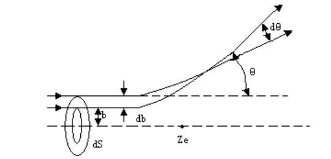

# 电磁学&近代物理 物竞复习

$$
    \newcommand{dbar}{\mathrm{d}\kern{-4.3pt}\bar{\small\phantom{q}}\kern{-0.7pt}}
    \newcommand{d}{\mathrm{d}}
    \newcommand{p}{\partial}
    \newcommand{l}{\left}
    \newcommand{r}{\right}
$$

## 一、电学

### 1.基本微分方程组

$$
\begin{aligned}
    \nabla\cdot{\boldsymbol{D}}&=\rho_f
    \\\nabla\times{\boldsymbol{E}}&=-\frac{\p{\boldsymbol{B}}}{\p{t}}
    \\\nabla\cdot{\boldsymbol{B}}&=0
    \\\nabla\times\boldsymbol{H}&=\boldsymbol{j}_f+\frac{\p{\boldsymbol{D}}}{\p{t}}
\end{aligned}
$$

### 2.静电场极化

#### (1).介质球柱的极化

首先给出静电场的拉普拉斯方程：
    $$
        \nabla^2\varphi=0
    $$

以及球坐标系下轴对称拉普拉斯方程的通解：
    $$
        \varphi=\sum_n\l(A_nr^n+\frac{B_n}{r^{n+1}}\r)P_n(\cos{\theta})
    $$

其中 $P_n(x)$ 是勒让德多项式。
设球外电势分布为 $\varphi_1$，设球内电势分布为 $\varphi_2$.
根据基本微分方程组，我们可以给出本问题的边值关系：
    $$
    \begin{aligned}
        \l.\varphi_1\r|_R&=\l.\varphi_2\r|_R
        \\\varepsilon_1\l.\frac{\p{\varphi_1}}{\p{r}}\r|_R&=\varepsilon_2\l.\frac{\p{\varphi_2}}{\p{r}}\r|_R
    \end{aligned}
    $$

以及边界条件：
    $$
    \begin{aligned}
        \lim_{r\rightarrow\infty}\varphi_1&=-E_0r\cos{\theta}
        \\\lim_{r\rightarrow{0}}\varphi_2&=finity
    \end{aligned}
    $$

将通解带入边界条件，有：
    $$
    \begin{aligned}
        \varphi_1&=-E_0r\cos{\theta}+\sum_n\frac{B_{1n}}{r^{n+1}}P_n(\cos{\theta})
        \\\varphi_2&=\sum_nA_{2n}r^nP_n(\cos{\theta})
    \end{aligned}
    $$

再将通解带入边值关系，有：
    $$
    \begin{aligned}
        -E_0R\cos{\theta}+\sum_n\frac{B_{1n}}{R^{n+1}}P_n(\cos{\theta})=\sum_nA_{2n}R^nP_n(\cos{\theta})
    \end{aligned}
    $$

以及：
    $$
        \varepsilon_1\l(-E_0\cos{\theta}-\sum_n(n+1)\frac{B_{1n}}{R^{n+2}}P_n(\cos{\theta})\r)\\=\varepsilon_2\l(\sum_nnA_{2n}R^{n-1}P_n(\cos{\theta})\r)
    $$

依据勒让德多项式的正交性，进行对比系数，有：
    $$
    \begin{aligned}
        -E_0+\frac{B_{11}}{R^3}&=A_{21}
        \\-\varepsilon_1\l(E_0+2\frac{B_{11}}{R^3}\r)&=\varepsilon_2A_{21}
    \end{aligned}
    $$

联立解得：
    $$
    \begin{aligned}
        B_{11}&=\frac{\varepsilon_2-\varepsilon_1}{\varepsilon_2+2\varepsilon_1}E_0R^3
        \\A_{21}&=-\frac{3\varepsilon_1}{\varepsilon_2+\varepsilon_1}E_0
    \end{aligned}
    $$

于是有：
    $$
    \begin{aligned}
        \varphi_1&=-E_0r\cos{\theta}+\frac{\varepsilon_2-\varepsilon_1}{\varepsilon_2+2\varepsilon_1}\frac{R^3}{r^{2}}E_0\cos{\theta}
        \\\varphi_2&=-\frac{3\varepsilon_1}{\varepsilon_2+\varepsilon_1}E_0r\cos{\theta}
    \end{aligned}
    $$

**以上过程演示了简单情况下拉普拉斯方程的求解。
接下来我们不加证明的给出其余结论方便记忆。**

#### (2).介质柱在匀强场的极化

球坐标系下轴对称体系拉普拉斯方程的通解为：
    $$
        \varphi=C_0+D_0\ln{r}+\sum_{n=1}^{\infty}\l(A_n\cos{n\theta}+B_n\sin{n\theta}\r)\l(C_nr^n+D_nr^{-n}\r)
    $$

基于此通解，我们可以得到介质柱在匀强场中的极化：
    $$
    \begin{aligned}
        \varphi_1&=-E_0r\cos{\theta}+\frac{\varepsilon_2-\varepsilon_1}{\varepsilon_2+\varepsilon_1}\frac{R^2}{r}E_0\cos{\theta}
        \\\varphi_2&=-\frac{2\varepsilon_1}{\varepsilon_2+\varepsilon_1}E_0r\cos{\theta}
    \end{aligned}
    $$

#### (3).导体椭球的电容

$$
    C=\frac{4\pi\varepsilon_0\sqrt{a^2-c^2}}{F\l(\arcsin{\sqrt{\frac{a^2-c^2}{a^2}}},\sqrt{\frac{a^2-b^2}{a^2-c^2}}\r)}
$$

其中 $F(\phi,k)$ 为第一类椭圆积分。
*特殊情况*：
旋转椭球面的电容：
    $$
        C=\l\{
            \begin{aligned}
                &\frac{8\pi\varepsilon_0\sqrt{b^2-a^2}}{\ln{\frac{b+\sqrt{b^2-a^2}}{b-\sqrt{b^2-a^2}}}}\qquad b>a
                \\
                \\&\frac{4\pi\varepsilon_0\sqrt{a^2-b^2}}{\arcsin{\frac{\sqrt{a^2-b^2}}{a}}}\qquad b<a
            \end{aligned}
        \r.
    $$

### 2.轴对称磁场的相关性质

考虑与 $\theta$ 无关的轴对称磁场，根据磁场散度为零，我们有：
    $$
        \frac{1}{\rho}\frac{\p{(\rho{B_\rho})}}{\p{\rho}}+\frac{\p{B_z}}{\p{z}}=0
    $$

认为 $\displaystyle\frac{\p{B_z}}{\p{z}}$ 近似不变，我们就有：
    $$
        B_\rho\approx-\frac{\rho}{2}\frac{\p{B_z}}{\p{z}}
    $$

该关系在磁镜等情况下十分常用。

### 3.偶极子相关

偶极子产生的势与场：
    $$
    \begin{aligned}
        \varphi&=\frac{1}{4\pi\varepsilon_0}\frac{\boldsymbol{p}\cdot\boldsymbol{r}}{r^3}
        \\\boldsymbol{E}&=\frac{1}{4\pi\varepsilon_0}\frac{p}{r^3}(2\cos{\theta}\hat{r}+\sin{\theta}\hat{\theta})
    \end{aligned}
    $$

偶极子在外场中的性质：
    $$
    \begin{aligned}
        E_p&=-\boldsymbol{p}\cdot\boldsymbol{E}
        \\\boldsymbol{F}&=(\boldsymbol{p}\cdot\nabla)\boldsymbol{E}
        \\\boldsymbol{M}&=\boldsymbol{p}\times\boldsymbol{E}\quad(力偶矩)
    \end{aligned}
    $$

### 4.介质气体极化率的微观解释

&emsp;&emsp;考虑一个充满分子小球的气体，对该气体施加一个外场，则其中的每个小球都会受到一个场的作用而产生极化，于是整个气体宏观上便会产生极化，考虑研究宏观的极化性质与微观的粒子极化之间的关系。
&emsp;&emsp;假设分子数密度为 $n$，每个分子小球在感受到外电场后会产生偶极矩，满足：
    $$
        \boldsymbol{p}=\alpha\boldsymbol{E_{micro}}
    $$

依据极化强度矢量的定义，有：
    $$
        \boldsymbol{P}=\frac{N\boldsymbol{p}}{V}=n\boldsymbol{p}
    $$

以及宏观极化性质：
    $$
        \boldsymbol{P}=\chi\epsilon_0\boldsymbol{E_{macro}}
    $$

认为小球所感受到的电场与小球本身的电场叠加后产生宏观外电场，于是有：
    $$
        \boldsymbol{E_{micro}}-\frac{\boldsymbol{P}}{3\varepsilon_0}=\boldsymbol{E_{macro}}
    $$

于是我们有：
    $$
        \boldsymbol{E_{micro}}-\frac{n\alpha\boldsymbol{E_{micro}}}{3\varepsilon_0}=\frac{n\alpha\boldsymbol{E_{micro}}}{\chi\varepsilon_0}
    $$

得出：
    $$
        \chi=\frac{n\alpha}{(1-\frac{n\alpha}{3\varepsilon_0})\varepsilon_0}
    $$

认为分子是导体球，带入 $\alpha=4\pi{R^3}\varepsilon_0$，有：
    $$
        \chi=\frac{4\pi{R^3}n}{1-\frac{4\pi{R^3}n}{3}}
    $$

### 5.磁电类比

以上所有公式中，进行如下替换，即可适用于静磁场。 
    $$
    \begin{aligned}
        \boldsymbol{E}&\rightarrow\boldsymbol{H}=\frac{\boldsymbol{B}}{\mu}
        \\\varepsilon&\rightarrow\mu
        \\\boldsymbol{p}&\rightarrow\boldsymbol{p_m}=\mu_0\boldsymbol{m}
        \\\boldsymbol{P}&\rightarrow\boldsymbol{P_m}=\mu_0\boldsymbol{M}
    \end{aligned}
    $$

### 6.电磁场的洛伦兹变换

$$
\begin{aligned}
    E_x'&=E_x
    \\E_y'&=\gamma(E_y-\beta{B_z})
    \\E_z'&=\gamma(E_z+\beta{B_y})
    \\B_x'&=B_x
    \\B_y'&=\gamma\l(B_y+\beta{\frac{E_z}{c}}\r)
    \\B_z'&=\gamma\l(B_z-\beta{\frac{E_y}{c}}\r)
\end{aligned}
$$

### 7.等离子相关

#### (1).屏蔽库伦势

&emsp;&emsp;考虑热平衡下的等离子体中放置一个静止点电荷，其位置为 $\boldsymbol{x}=0$，电荷密度 $\rho=q\delta(\boldsymbol{x})$，记等离子体中正离子数密度为 $n_p(\boldsymbol{x})$，电子数密度 $n_e(\boldsymbol{x})$，设正离子带电量 $Ze$，满足 $n_pZe=n_{e0}$.
&emsp;&emsp;依据泊松方程，有：
    $$
        \varepsilon_0\nabla^2\varphi=-n_pZe+n_ee-q\delta(\boldsymbol{x})
    $$

一般情况下忽略正离子运动，并认为电子密度满足玻尔兹曼分布，有: 
    $$
        n_e=n_{e0}\exp\l(\frac{e\varphi}{kT}\r)\sim n_{e0}\l(1+\frac{e\varphi}{kT}\r)
    $$

带回方程，得到：
    $$
        \l(\nabla^2-\frac{1}{\lambda^2}\r)\varphi=-\frac{q}{\varepsilon_0}\delta(\boldsymbol{x})
    $$

其中有 $\displaystyle\lambda^2=\frac{kT\varepsilon_0}{n_{e0}e^2}$.
上式为标准的亥姆霍兹方程，考虑到方程右侧是Delta函数，其解显然为亥姆霍兹方程的格林函数，即：
    $$
        G(\boldsymbol{x})=\frac{q}{4\pi\varepsilon_0r}\exp\l(-\frac{r}{\lambda}\r)
    $$

称为屏蔽库伦势。
于是，依据格林函数法，我们可以得到等离子体内任意额外电荷分布 $\rho_e$ 产生的电势：
    $$
        \varphi=\int\frac{\rho_e(\boldsymbol{x'})}{4\pi\varepsilon_0|\boldsymbol{x'}-\boldsymbol{x}|}\exp\l(-\frac{|\boldsymbol{x'}-\boldsymbol{x}|}{\lambda}\r)d^3x'
    $$

#### (2).等离子体振荡

忽略正离子运动，设电子平均运动速度为 $\boldsymbol{v}$，有：
    $$
    \begin{aligned}
        \frac{\d{n}}{\d{t}}+\nabla\cdot(n\boldsymbol{v})&=0
        \\m\frac{\p{\boldsymbol{v}}}{\p{t}}+m(\boldsymbol{v}\cdot\nabla)\boldsymbol{v}&=-e\boldsymbol{E}
        \\\nabla\cdot\boldsymbol{E}=-(n-&n_{e0})\frac{e}{\varepsilon_0}
    \end{aligned}
    $$

认为 $n'=(n-n_0)$ 与 $\boldsymbol{v}$ 是小量，线性化并消元后有：
    $$
        \frac{\d^2n'}{\d{t}^2}+\frac{e^2n_{e0}}{m\varepsilon_0}n'=0
    $$

于是有：
    $$
        \omega=\sqrt{\frac{e^2n_{e0}}{m\varepsilon_0}}
    $$

## 二、近代物理

### 1.康普顿散射

结论公式：
    $$
        \lambda'-\lambda=\frac{h}{m_0c}(1-\cos{\varphi})
    $$

### 2.氢原子能级

#### (1).里德伯常量、玻尔半径

$$
\begin{aligned}
    R_H=\frac{m_ee^4}{8\varepsilon_0^2ch^3}=1.097373157\times10^7(m^{-1})
    a_0=\frac{\hbar}{m_ec\alpha}
\end{aligned}
$$

其中 $\alpha$ 为精细结构常数，有 $\alpha=\frac{e^2}{4\pi\varepsilon_0c\hbar}$.

#### (2).氢原子能级

$$
    \frac{1}{\lambda}=R_H\l(\frac{1}{n^2}-\frac{1}{m^2}\r)
$$

### 3.微分散射界面与卢瑟福公式

&emsp;&emsp;&emsp;&emsp;&emsp;&emsp;
$$
    \frac{\d\sigma}{\d\Omega}=\frac{1}{16}\l(\frac{2Ze^2}{4\pi\varepsilon_0E}\r)^2\frac{1}{\sin^4(\frac{\theta}{2})}
$$

其中 $E=\frac{1}{2}mv_0^2$ 为入射粒子动量。