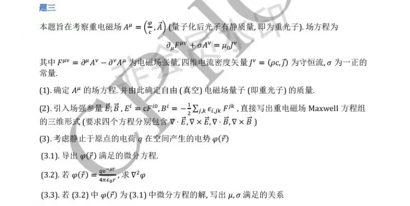

# 重光子场（普适矢量场）

## (1).由给定的场方程确定 $A^\mu$ 的场方程并确定自由电磁场量子的质量

### 1.Solution

首先考虑具有规范不变性的标准形式的矢量场 Lagrangian：
    $$
        \mathcal{L}=-\frac{1}{4}F_{\mu\nu}F^{\mu\nu}+\frac{1}{2}m^2A_{\mu}A^{\mu}+A_{\mu}J^{\mu}
    $$
其中 $F^{\mu\nu}=(\partial^{\mu}A^{\nu}-\partial^{\nu}A^{\mu})$
带入场的 Euler-Lagrange 方程：
    $$
        \partial_\alpha\frac{\partial{\mathcal{L}}}{\partial{(\partial_{\alpha}A_{\beta})}}-\frac{\partial{\mathcal{L}}}{\partial{A_\beta}}=0
    $$
可以得到：
    $$
        \partial_{\mu}F^{\mu\nu}+m^2A^{\nu}=J^{\nu}
    $$
*p.s.以上推导使用自然单位制*
换回国际单位制，我们就有：
    $$
        \partial_{\mu}F^{\mu\nu}+m^2A^{\nu}=\mu_0J^{\nu}
    $$
与给定方程对比，可得：
    $$
        \sigma=m^2
    $$
即：
    $$
        m=\sqrt{\sigma}
    $$
为“重光子”质量。

## (2).引入场强参量写出对应的三维形式 Maxwell 场方程组

### 2.Solution

首先，不论场的 Lagrangian 形式如何，下述恒等式对电磁场张量始终成立：
    $$
        \partial^{\lambda}F^{\mu\nu}+\partial^{\mu}F^{\nu\lambda}+\partial^{\nu}F^{\lambda\mu}=0
    $$
该恒等式直接给出 Maxwell 场方程组的两行：
    $$
    \begin{aligned}
        \nabla·\boldsymbol{B}&=0
        \\\nabla\times\boldsymbol{E}&=-\frac{\partial{\boldsymbol{B}}}{\partial{t}}
    \end{aligned}
    $$
其次，考虑给定场方程，有：
    $$
        \partial_{i}F^{i0}+\sigma A^{0}=\mu_0J^{0}
    $$
即：
    $$
        \nabla·\frac{\boldsymbol{E}}{c}+\sigma\frac{\varphi}{c}=\mu_0c\rho
    $$
亦即：
    $$
        \nabla·\boldsymbol{E}+\sigma\varphi=\frac{\rho}{\varepsilon_0}
    $$
即为“重光子场”的高斯定理；
再考虑给定场方程，有：
    $$
        \partial_0 F^{0i}+\partial_j F^{ji}+\sigma A^{i}=\mu_0J^i
    $$
考虑到电磁场张量的反对称性，我们有 $F^{0i}=-F^{i0}=-E^i$，以及 $F^{ji}=-F^{ij}={\epsilon^{ij}}_{k}B^k$
于是有：
    $$
        -\frac{1}{c^2}\frac{\partial{\boldsymbol{E}}}{\partial{t}}+\nabla\times\boldsymbol{B}+\sigma\boldsymbol{A}=\mu_0\boldsymbol{j}
    $$
即：
    $$
        \nabla\times\boldsymbol{B}+\sigma\boldsymbol{A}=\mu_0\boldsymbol{j}+\mu_0\varepsilon_0\frac{\partial{\boldsymbol{E}}}{\partial{t}}
    $$
即为“重光子场”的安培环路定理。
于是我们有重光子场的 Maxwell 场方程组为：
    $$
    \begin{aligned}
        \nabla·\boldsymbol{E}+\sigma\varphi&=\frac{\rho}{\varepsilon_0}
        \\\nabla\times\boldsymbol{E}&=-\frac{\partial{\boldsymbol{B}}}{\partial{t}}
        \\\nabla·\boldsymbol{B}&=0
        \\\nabla\times\boldsymbol{B}+\sigma\boldsymbol{A}&=\mu_0\boldsymbol{j}+\mu_0\varepsilon_0\frac{\partial{\boldsymbol{E}}}{\partial{t}}
    \end{aligned}
    $$

## (3).考虑静止于原点的电荷q在空间中产生的电势 $\varphi(\boldsymbol{r})$，导出其符合的微分方程并给出其解的形式

### 3.Solution

本题本质上是给出“重光子场”的电势所遵循的方程并求其格林函数。

#### 1.微分方程

考虑到电场强度的定义：$\boldsymbol{E}=-\nabla\varphi$，以及原点处点电荷的电荷密度为$q\delta(\boldsymbol{r})$，带入第一行 Maxwell 场方程，有：
    $$
        (-\nabla^2+\sigma)\varphi(\boldsymbol{r})=\frac{q\delta(\boldsymbol{r})}{\varepsilon_0}
    $$
亦即：
    $$
        (\nabla^2-\sigma)\varphi(\boldsymbol{r})=-\frac{q\delta(\boldsymbol{r})}{\varepsilon_0}
    $$
即所求方程。

#### 2.格林函数

##### 法1.正常算法

显然符合上述方程的电势为该方程的格林函数乘上一个系数。
记 $-\sigma=\omega^2$，有：
    $$
        (\nabla^2+\omega^2)G(\boldsymbol{r})=\delta(\boldsymbol{r})
    $$
方程左右两边做 Fourier Transform，
对左侧，有：
    $$
        G(\boldsymbol{r})=\int\frac{d^3k}{(2\pi)^3}e^{i\boldsymbol{k}·\boldsymbol{r}}\widetilde{G}(k)
    $$
对 $\delta(\boldsymbol{r})$ 的 Fourier Transform 显然为1.
带入上述方程，有：
    $$
        (-k^2+\omega^2)\widetilde{G}(k)=1
    $$
于是有：
    $$
        \widetilde{G}(k)=\frac{1}{-k^2+\omega^2}
    $$
代回 Fourier Transform，换到球坐标下并利用留数定理与 Jordan 引理计算积分，有：
    $$
    \begin{aligned}
        G(\boldsymbol{r})&=\int\frac{d^3k}{(2\pi)^3}e^{i\boldsymbol{k}·\boldsymbol{r}}\frac{1}{-k^2+\omega^2}
        \\&=\frac{1}{(2\pi)^3}\int^{2\pi}_0\int^{\pi}_0\int^{\infty}_{0}\frac{1}{-k^2+\omega^2}e^{ikr\cos{\theta}}k^2\sin{\theta}\:\mathrm{d}k\:\mathrm{d}\theta\:\mathrm{d}\varphi
        \\&=\frac{1}{(2\pi)^2}\int^{\infty}_{0}\frac{k^2}{-k^2+\omega^2}\frac{1}{kr}(e^{ikr}-e^{-ikr})\:\mathrm{d}k
        \\&=\frac{1}{2\pi^2r}\int^{\infty}_{0}\frac{k\sin{kr}}{-k^2+\omega^2}\:\mathrm{d}k
        \\&=\mathrm{Im}\left[\frac{1}{4\pi^2r}\int^{\infty}_{-\infty}\frac{k}{-k^2+\omega^2}e^{ikr}\:\mathrm{d}k\right]
        \\&=\mathrm{Im}\left[\frac{1}{4\pi^2r}\int^{\infty}_{-\infty}\frac{k}{-k^2+\omega^2}e^{ikr}\:\mathrm{d}k\right]
        \\&=\mathrm{Im}\left[-\frac{ie^{i\omega r}}{4\pi r}\right]
        \\&=-\frac{e^{i\omega r}}{4\pi r}
    \end{aligned}
    $$
带入 $\omega=i\sqrt{\sigma}=im$，有：
    $$
        G(\boldsymbol{r})=-\frac{e^{-\sqrt{\sigma}r}}{4\pi r}
    $$
于是显然有：
    $$
        \varphi(\boldsymbol{r})=-\frac{q}{\varepsilon_0}G(\boldsymbol{r})=\frac{qe^{-\sqrt{\sigma}r}}{4\pi\varepsilon_0r}
    $$
与题目给出函数对比，自然有：
    $$
        \mu=\sqrt{\sigma}=m
    $$

##### 法2.按着题走

带入题目给出的解，得到：
    $$
        \nabla^2\varphi=\frac{qu^2e^{-\mu r}}{4\pi\varepsilon_0r}
    $$
于是有：
    $$
        \frac{e^{-ur}}{4\pi r}(\sigma-\mu^2)=\delta(\boldsymbol{r})
    $$
显然我们要求 $\boldsymbol{r}\neq0$ 时等式右端为零，于是有：
    $$
        \sigma=\mu^2
    $$
直接得到 $\mu=\sqrt{\sigma}$，即为答案。
