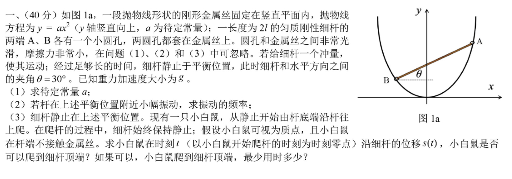

# 三十九届决赛第一题

## 1.求解待定常量 a
解：首先列出关联：

$$
\left\{
	\begin{aligned}
		a(x_c-l\:\mathrm{cos}\theta)^2&=y_c-l\:\mathrm{sin}\theta\\
		a(x_c+l\:\mathrm{cos}\theta)^2&=y_c+l\:\mathrm{sin}\theta
	\end{aligned}
\right.
$$

解得：

$$
    \left\{
        \begin{aligned}
            x_c&=\frac{\mathrm{tan}\theta}{2a}\\
            y_c&=\frac{4a^2l^2\:\mathrm{cos}^2\theta+\mathrm{tan}^2\theta}{4a}
        \end{aligned}
    \right.
$$

列出 Lagrangian：

$$
\begin{aligned}
    L&=T-V
    \\&=\frac{1}{2}m{\dot{x_c}}^2+\frac{1}{2}m{\dot{y_c}}^2+\frac{1}{2}I{\dot{\theta}}^2-mgy_c
\end{aligned}
$$

由几何约束有：

$$
    \left\{
        \begin{aligned}
            \dot{x_c}&=\frac{\dot\theta}{2a\:\mathrm{cos}^2\theta}\\
            \dot{y_c}&=\frac{2\mathrm{tan}\theta-8a^2l^2\:\mathrm{cos}^3\theta\mathrm{sin}\theta}{4a\:\mathrm{cos}^2\theta}\dot{\theta}
        \end{aligned}
    \right.
$$

带入 Lagrangian，有：

$$
\begin{aligned}
    L&=\frac{1}{2}m{\frac{1}{4a^2\:\mathrm{cos}^4\theta}}\dot{\theta}^2+\frac{1}{2}m\left({\frac{2\mathrm{tan}\theta-8a^2l^2\:\mathrm{cos}^3\theta\mathrm{sin}\theta}{4a\:\mathrm{cos}^2\theta}}\right)^2\dot{\theta}^2+\frac{1}{2}I{\dot{\theta}}^2-mg\frac{4a^2l^2\:\mathrm{cos}^2\theta+\mathrm{tan}^2\theta}{4a}
\end{aligned}
$$

带入 Eular-Lagrange 方程并带入初始条件$\displaystyle(\theta=\frac{\pi}{6},\dot\theta=0,\ddot{\theta}=0)$有：

$$
    \frac{2}{\sqrt{3}}-4a^2l^2\:(\frac{\sqrt{3}}{2})^3=0
$$

推出：

$$
    a=\frac{2}{3l}
$$

即所求。

## 2.求解小振动频率
解：
首先列出精确的 Lagrangian ：
$$
\begin{aligned}
    L&=\frac{1}{2}m{\frac{1}{4a^2\:\mathrm{cos}^4\theta}}\dot{\theta}^2+\frac{1}{2}m\left({\frac{2\mathrm{tan}\theta-8a^2l^2\:\mathrm{cos}^3\theta\mathrm{sin}\theta}{4a\:\mathrm{cos}^2\theta}}\right)^2\dot{\theta}^2+\frac{1}{2}I{\dot{\theta}}^2-mg\frac{4a^2l^2\:\mathrm{cos}^2\theta+\mathrm{tan}^2\theta}{4a}
\end{aligned}
$$

**对 Lagrangian 在 $\displaystyle \frac{\pi}{6}$ 附近做泰勒展开**
并舍去高阶小量（耦合项视为高阶小量）
有：

$$
    L\sim\frac{2}{3}l^2m{\dot{(\delta\theta)}}^2-\frac{2lmg}{3}(\delta\theta)^2-\frac{5lmg}{8}
$$

带入 Eular-Lagrange 方程，有：

$$
    \frac{4ml^2}{3}\ddot{(\delta\theta)}+\frac{4mgl}{3}\delta\theta=0
$$

于是有：

$$
    \omega=\sqrt{\frac{g}{l}}
$$

即：

$$
    f=\frac{\omega}{2\pi}=\frac{1}{2\pi}\sqrt{\frac{g}{l}}
$$

（什么时候答案这么简单了？）

## 3.求解 $s(t)$ 以及到达时间
考虑到杆始终处于平衡位置，要求小鼠对杆的力与支持力、杆重力共点。于是有：

$$
    \mathrm{tan}\varphi=\frac{h}{s'+d}=\frac{F_y}{F_x}
$$

其中：

$s'$为质心到小鼠的距离；

$$
    h=\frac{\sqrt{3}}{2}l
$$

为共点到杆的距离；

$$
    d=h\:\mathrm{tan}\theta
$$

为过共点垂直于杆的垂线的垂足到质心的距离。

由牛顿第二定律与受力分析有：

$$
\begin{aligned}
    F_x&=g\:\mathrm{sin}\theta-\ddot{s}'\\
    F_y&=g\:\mathrm{cos}\theta
\end{aligned}
$$

代入共点式有：

$$
    \frac{g\:\mathrm{cos}\theta}{g\:\mathrm{sin}\theta-\ddot{s}'}=\frac{\frac{\sqrt{3}}{2}l}{s'+\frac{\sqrt{3}}{2}l\:\mathrm{tan}\theta}
$$

化简后有：

$$
    l\ddot{s}'+gs=0
$$

解得：

$$
    s'(t)=A\:\mathrm{cos}\left(\sqrt{\frac{g}{l}}t+\phi\right)
$$

利用初始条件：

$$
    s'(0)=l,\quad\dot{s}'(0)=0
$$

得到：

$$
    s'(t)=l\:\mathrm{cos}\left(\sqrt{\frac{g}{l}}t\right)
$$

于是有：

$$
    s(t)=l-s'(t)=-l\:\mathrm{cos}\left(\sqrt{\frac{g}{l}}t\right)+l
$$

于是时间为：

$$
    t=\pi\sqrt{\frac{l}{g}}
$$
