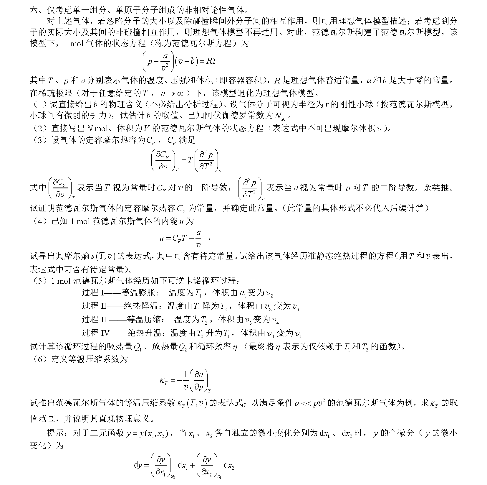

# 三十九届决赛第六题

## 1. $b$ 的物理含义与表达式

解：
首先我们可以从表达式看到 $b$ 与体积 $v$ 应当有相同的量纲，即 $b$ 应当表征某种体积。其次我们可以看到理想气体状态方程中的 $V$ 在范氏气体中被修正为了 $(v-b)$ ，这说明 $b$ 表征了修正模型相对原本模型中体积的减少量。联系到范氏气体修正考虑分子体积，不难想到 $b$ 表征的即是分子体积对总体积的影响。
考虑对于一对分子，自由体积的减少量为：
    $$
        \Delta{v}=\frac{4}{3}\pi{(2r)^3}=\frac{32}{3}\pi{r^3}
    $$
由于该修正量为一对分子共有，所以总修正量为：
    $$
        b=\frac{1}{2}N_A\Delta{v}=\frac{16}{3}N_A\pi{r^3}
    $$

## 2. $N$ 摩尔气体的范德瓦尔斯方程

解：考虑到对于一团气体，若其体积增加到原来的 $N$ 倍的同时分子数也增大到原来的 $N$ 倍，其压强 $p$ 不会发生改变。于是有：
    $$
        \left(p+\frac{N^2a}{V^2}\right)\left(V-Nb\right)=NRT
    $$
即为修正后 $N$ 摩尔气体的范德瓦尔斯方程。

## 3. 定容摩尔热容 $C_V$

解：
首先由范氏方程得到 $p$ 的表达式：
    $$
        p=\frac{RT}{v-b}-\frac{a}{v^2}
    $$
于是有：
    $$
        T\left(\frac{\partial}{\partial{T}}\left(\frac{\partial{p}}{\partial{T}}\right)_v\right)_v=T\left(\frac{\partial}{\partial{T}}\left(\frac{R}{v-b}\right)\right)_v=0
    $$
即：
    $$
        \left(\frac{\partial{C_V}}{\partial{v}}\right)_T=0
    $$
亦即 $C_V$ 仅与 $T$ 有关。而考虑到稀疏极限 $\displaystyle{\lim_{v\to\infty}}$ 下 $C_V$ 应当退化到 $\displaystyle\frac{i}{2}R$ ，于是有 $C_V$ 与 $T$ 无关，即 $C_V$ 为一常量，单原子下为 $\displaystyle\frac{3}{2}R$ 。

## 4.摩尔熵与绝热方程

解：
考虑热力学基本微分方程：
    $$
        \mathrm{d}U=T\mathrm{d}S-p\mathrm{d}V
    $$
带入 $1\rm{mol}$ 下 $U$ 的表达式，有：
    $$
    \begin{aligned}
        C_V\mathrm{d}T+\frac{a}{v^2}\mathrm{d}v&=T\mathrm{d}s-p\mathrm{d}v
        \\T\mathrm{d}s&=C_V\mathrm{d}T+\left(\frac{a}{v^2}+p\right)\mathrm{d}v
        \\\mathrm{d}s&=\frac{C_V}{T}\mathrm{d}T+\frac{R}{v-b}\mathrm{d}v
        \\\int\mathrm{d}s&=\int\frac{C_V}{T}\mathrm{d}T+\int\frac{R}{v-b}\mathrm{d}v
        \\s&=C_V\ln{T}+R\ln{(v-b)}+s_0
    \end{aligned}
    $$
即摩尔熵表达式。
准静态绝热条件下 $\displaystyle\mathrm{d}s=\frac{\mathrm{\delta{Q}}}{T}=0$ ，于是令 $s=s_0+\mathrm{C}$ ，既有：
    $$
        C_V\ln{T}+R\ln{(v-b)}=\mathrm{C}
    $$
即为准静态下绝热方程。

## 5.计算给定过程的吸放热以及循环效率

解：
首先考虑过程 I：
吸热：
    $$
    \begin{aligned}
        \delta{Q}&=\mathrm{d}U+p\mathrm{d}v
        \\&=C_V\mathrm{d}T+\frac{a}{v^2}\mathrm{d}v+p\mathrm{d}v
        \\&=\frac{RT_1}{v-b}\mathrm{d}v
        \\\int\delta{Q}&=\int_{v_1}^{v_2}\frac{RT_1}{v-b}\mathrm{d}v
        \\Q_1&=RT_1\ln{\frac{v_2-b}{v_1-b}}
    \end{aligned}
    $$
做功：
    $$
    \begin{aligned}
        W_1&=\int{p}\mathrm{d}v
        \\&=\int_{v_1}^{v_2}{\left(\frac{RT_1}{v-b}-\frac{a}{v^2}\right)}\mathrm{d}v
        \\&=RT_1\ln{\frac{v_2-b}{v_1-b}}+a\frac{v_2-v_1}{v_1v_2}
    \end{aligned}
    $$
然后考虑 过程 II：
    $$
    \begin{aligned}
        W_2&=\int{p}\mathrm{d}v
        \\&=-\int_{T_1}^{T_2}{C_V}\mathrm{d}T-\int_{v_2}^{v_3}{\frac{a}{v^2}}\mathrm{d}v
        \\&=a\frac{v_3-v_2}{v_2v_3}-C_V(T_2-T_1)
    \end{aligned}
    $$
然后考虑过程 III：
    $$
        Q_2=RT_2\ln{\frac{v_4-b}{v_3-b}}
    $$
    $$
        W_3=RT_2\ln{\frac{v_4-b}{v_3-b}}+a\frac{v_4-v_3}{v_3v_4}
    $$
最后考虑过程 IV：
    $$
        W_4=a\frac{v_1-v_4}{v_1v_4}-C_V(T_1-T_2)
    $$
于是有：
    $$
    \begin{aligned}
        W&=W_1+W_2+W_3+W_4
        \\&=R\left(T_1\ln{\frac{v_2-b}{v_1-b}}+T_2\ln{\frac{v_4-b}{v_3-b}}+a\left(\frac{1}{v_1}-\frac{1}{v_2}+\frac{1}{v_2}-\frac{1}{v_3}+\frac{1}{v_3}-\frac{1}{v_4}+\frac{1}{v_4}-\frac{1}{v_1}\right)\right)
        \\&=R\left(T_1\ln{\frac{v_2-b}{v_1-b}}+T_2\ln{\frac{v_4-b}{v_3-b}}\right)
    \end{aligned}
    $$
以及：
    $$
        \eta=\frac{W}{Q_1}=1+\frac{T_2\ln{\frac{v_4-b}{v_3-b}}}{T_1\ln{\frac{v_2-b}{v_1-b}}}
    $$
由绝热方程有：
    $$
    \begin{aligned}
        T_1(v_1-b)^{\frac{R}{C_V}}&=T_2(v_2-b)^{\frac{R}{C_V}}
        \\T_2(v_3-b)^{\frac{R}{C_V}}&=T_1(v_4-b)^{\frac{R}{C_V}}
    \end{aligned}
    $$
于是有：
    $$
    \begin{aligned}
        \frac{v_2-b}{v_1-b}=\frac{v_3-b}{v_4-b}
    \end{aligned}
    $$
所以：
    $$
        \eta=\frac{W}{Q_1}=1-\frac{T_2}{T_1}
    $$

## 6.等温压缩系数
